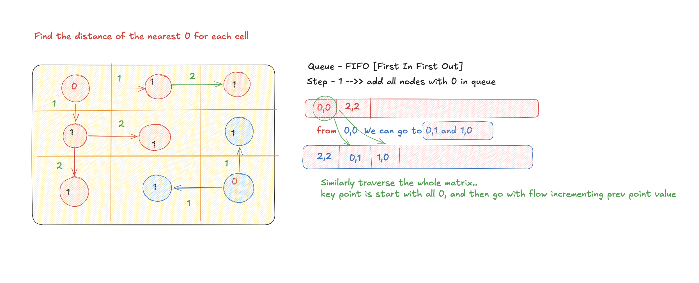

# 01 Matrix

- **Difficulty:** Medium
- **Categories:** Array, Breadth-First Search, Dynamic Programming, Matrix

---

## Complexity Analysis

- **Time Complexity:** $O(M \times N)$
  - We traverse the entire matrix once to find all zeros and initialize the queue.
  - Each cell is visited at most once during the BFS traversal.
- **Space Complexity:** $O(M \times N)$
  - In the worst case, the BFS queue could store up to $M \times N$ cells.
  - The result matrix also takes $O(M \times N)$ space.

---

Given a binary matrix, return a matrix of distances to the nearest 0 for each cell.

---

## Approach: Multi-Source BFS from All Zeros

Initialize BFS with all 0-cells (distance 0). BFS outward from all zeros simultaneously fills distances for 1-cells layer by layer.

---

## Related Interview Questions
- [Walls and Gates](../walls-and-gates/README.md)
- [Rotting Oranges](../rotting-oranges/README.md)
- [Shortest Path in Binary Matrix](../shortest-path-in-binary-matrix/README.md)
- [As Far from Land as Possible](../as-far-from-land-as-possible/README.md)

---

## Learn More
- [NeetCode](https://neetcode.io/problems/01-matrix)
- [LeetCode](https://leetcode.com/problems/01-matrix/)
