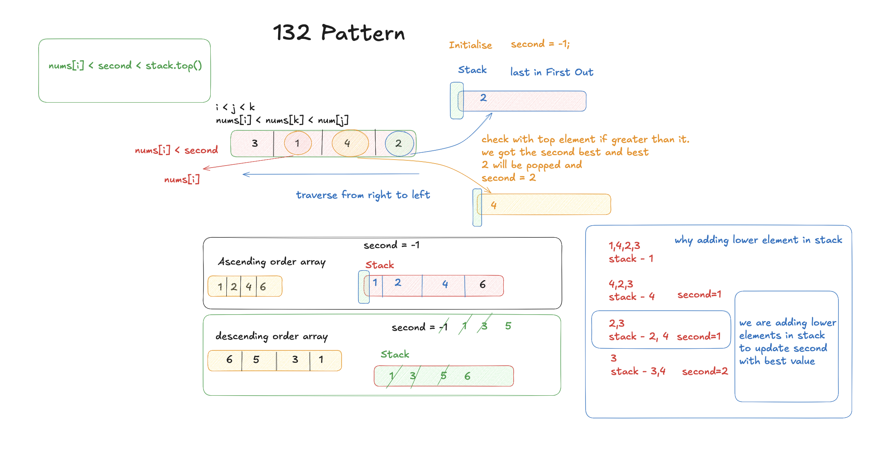

# 132 Pattern

- **Difficulty:** Medium
- **Categories:** Array, Binary Search, Stack, Monotonic Stack

---

## Complexity Analysis

- **Time Complexity:** $O(N)$
  - We traverse the array once from right to left.
  - Each element is pushed and popped from the monotonic stack at most once.
- **Space Complexity:** $O(N)$
  - In the worst case, the monotonic stack could store all $N$ elements.

---

Find if there exists a 132 pattern ($nums[i] < nums[k] < nums[j]$ where $i < j < k$).

---

## Approach: Monotonic Stack + Track Min

Traverse right to left. Maintain a stack and a 'third' value (the '2' in 132). Pop elements smaller than current onto 'third'. If current < 'third', 132 pattern found.

---

## Related Interview Questions
- [Next Greater Element I](../next-greater-element-i/README.md)
- [Next Greater Element II](../next-greater-element-ii/README.md)
- [Daily Temperatures](../daily-temperatures/README.md)
- [Largest Rectangle in Histogram](../largest-rectangle-in-histogram/README.md)

---

## Learn More
- [NeetCode](https://neetcode.io/problems/132-pattern)
- [LeetCode](https://leetcode.com/problems/132-pattern/)
