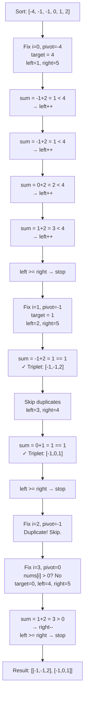
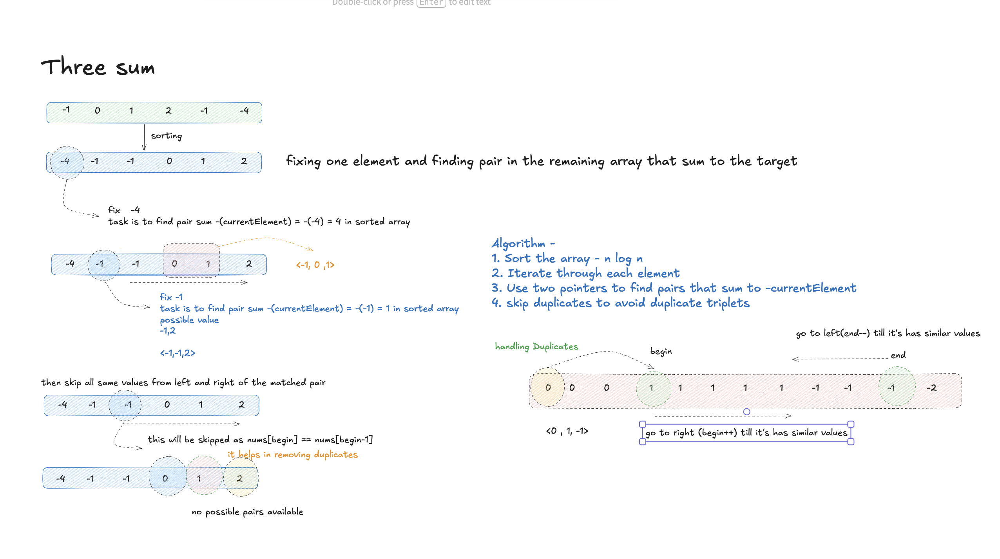

# 3Sum - Explanation

Given an integer array `nums`, return all unique triplets `[nums[i], nums[j], nums[k]]` such that `i != j`, `i != k`, `j != k`, and `nums[i] + nums[j] + nums[k] == 0`. The solution set must not contain duplicate triplets.

---

## Approach 1: Two-Pointer (Optimal)

### The Core Idea

Sort the array first. Then **fix one element at a time** (the pivot `nums[i]`) and reduce the remaining problem to finding a pair in the sorted sub-array that sums to `-nums[i]`. Use two pointers — one starting just after `i` (left) and one at the end (right) — and converge them based on the current sum.

Because the array is sorted:
- If `left + right < target` → move `left` right (need a larger value)
- If `left + right > target` → move `right` left (need a smaller value)
- If equal → record the triplet, then skip duplicates on both sides

### Algorithm Steps

1. **Sort** `nums` in ascending order — `O(n log n)`
2. **Iterate** `i` from `0` to `n - 3` (pivot element)
   - Early-exit: if `nums[i] > 0`, no triplet can sum to zero (array is sorted)
   - Skip duplicate pivots: `if (i > 0 && nums[i] == nums[i-1]) continue`
3. Set `left = i + 1`, `right = n - 1`, `target = -nums[i]`
4. **Two-pointer loop** while `left < right`:
   - Compute `sum = nums[left] + nums[right]`
   - `sum == target` → push triplet, skip duplicate lefts and rights, then advance both pointers
   - `sum < target`  → `left++`
   - `sum > target`  → `right--`

### Traversal Diagram



### Complexity
- **Time Complexity:** O(n²) — sorting is O(n log n), the two-pointer loop is O(n) per pivot element
- **Space Complexity:** O(1) excluding the output list (sort is in-place)

---

## Approach 2: Brute Force

Try every combination of three indices `(i, j, k)` and check if their sum equals zero. Deduplicate by sorting each candidate triplet before checking for duplicates in the result list.

- **Time Complexity:** O(n³)
- **Space Complexity:** O(n) for the deduplication check

---

## Common Pitfalls

### 1. Forgetting to Skip Duplicate Pivots
**Problem:** When `nums[i] == nums[i-1]`, fixing the same pivot again will produce the exact same set of triplets.  
**Fix:** Skip immediately after the first occurrence:
```cpp
if (i > 0 && nums[i] == nums[i - 1]) continue;
```

### 2. Forgetting to Skip Duplicates After a Match
**Problem:** After finding a valid triplet, the inner while loop must advance past duplicate values on both sides, otherwise the same triplet gets added again.  
**Fix:**
```cpp
while (left < right && nums[left] == nums[left + 1]) left++;
while (left < right && nums[right] == nums[right - 1]) right--;
left++;
right--;
```

### 3. Not Using the Early-Exit Optimization
**Problem:** If `nums[i] > 0`, all elements to its right are also positive (sorted), so no triplet summing to zero is possible. Continuing wastes time.  
**Fix:**
```cpp
if (nums[i] > 0) break;
```

### 4. Off-by-One in the Outer Loop
**Problem:** The outer loop only needs to run to `n - 3` (inclusive), since you need at least two more elements for the pair. Running to `n - 1` doesn't break correctness but is wasteful.  
**Fix:** `for (int i = 0; i < n - 2; i++)`

---

## Visual Concept



---

## Learn More (External Resources)

- [NeetCode – 3Sum](https://neetcode.io/problems/three-sum)
- [LeetCode Problem #15](https://leetcode.com/problems/3sum/)
- [GeeksforGeeks – Find a triplet that sum to a given value](https://www.geeksforgeeks.org/find-a-triplet-that-sum-to-a-given-value/)
