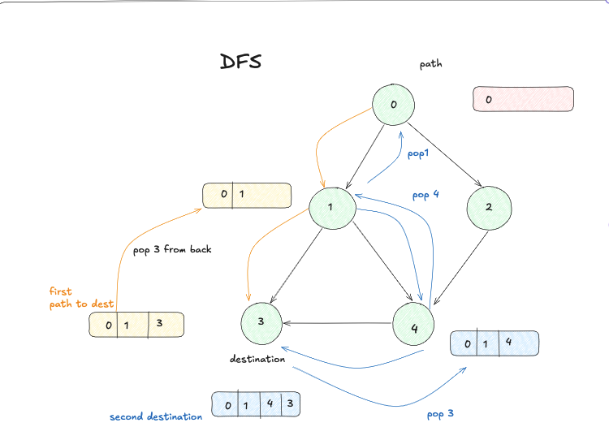
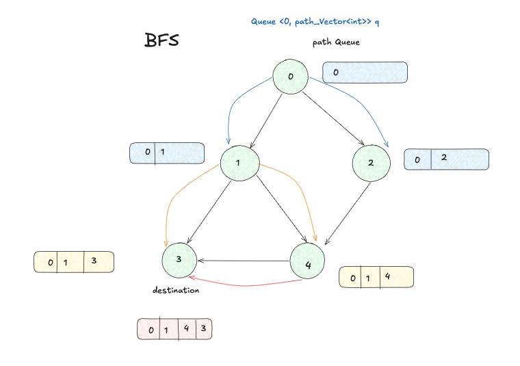

# All Paths From Source to Target

- **Difficulty:** Medium
- **Categories:** Backtracking, Depth-First Search, Breadth-First Search, Graph
- **Time Complexity:** O(2^N × N)
- **Space Complexity:** O(2^N × N)

---

Find all paths from node 0 to node n-1 in a DAG.

---

## Approach: Depth-First Search (Backtracking)

DFS from node 0. At each node, explore all neighbors. When node n-1 is reached, record the current path. Backtrack by removing the last node after recursion.


*Visual representation of the Depth-First Search (DFS) backtracking approach exploring paths from source to target.*

---

## Approach: Breadth-First Search

Standard BFS starting from the source node. Instead of storing just nodes, the queue stores the entire path traversed so far. When the target node is popped from the queue, the path is added to the result list.


*Visual representation of the Breadth-First Search (BFS) approach expanding level by level to find all paths.*

---

## Learn More
- [NeetCode](https://neetcode.io/problems/all-paths-from-source-to-target)
- [LeetCode](https://leetcode.com/problems/all-paths-from-source-to-target/)

---

## Related Interview Questions
- [Path Sum II](../path-sum-ii/README.md)
- [Binary Tree Paths](../binary-tree-paths/README.md)
- [Word Search](../word-search/README.md)
- [Find Eventual Safe States](../find-eventual-safe-states/README.md)

---

# Time & Space Complexity Summary
 
## All Paths From Source to Target (LeetCode 797)
 
### Quick Summary Table
 
| Component | Complexity | Reason |
|-----------|-----------|--------|
| # of paths | O(2^N) | Exponential in worst case |
| Length of each path | O(N) | From source to target |
| Copying each path | O(N) | Array copy operation |
| **Total** | **O(2^N × N)** | Paths × Path operations |
 
---
 
## Detailed Explanation
 
### Time Complexity: O(2^N × N)
 
#### 1. Number of Paths: O(2^N)
- In a fully connected DAG, there are exponentially many paths from source to target
- Each intermediate node presents choices, leading to 2^N possible combinations
- This is the dominant factor in path count
#### 2. Cost Per Path: O(N)
- Each path from node 0 to node (N-1) has length up to N
- Creating/copying each path takes O(N) time
- Pushing to result vector takes O(N) time per path
#### 3. Total Work
```
Total Time = (Number of Paths) × (Cost per Path)
           = O(2^N) × O(N)
           = O(2^N × N)
```
 
---
 
### Space Complexity: O(2^N × N)
 
#### Storage for Result
- **2^N paths** in the worst case
- Each path has **length N**
- **Total elements stored:** 2^N × N
#### Auxiliary Space
- Queue/recursion stack: O(N) for single path tracking
- This is negligible compared to output space
#### Total Space
```
Total Space = Output Space + Auxiliary Space
            = O(2^N × N) + O(N)
            = O(2^N × N)
```
 
---
 
## Example: N = 4 Nodes
 
```
Number of paths ≈ 16 (i.e., 2^4)
Average path length ≈ 3-4 nodes
Total elements in result ≈ 16 × 3.5 ≈ 56
 
Complexity Analysis:
├─ Time: O(2^4 × 4) = O(16 × 4) = O(64) operations
└─ Space: O(2^4 × 4) = O(16 × 4) = O(64) units
```
 
---
 
## Why Not Just O(2^N)?
 
❌ **Incomplete:** Ignoring path length in calculation
✅ **Correct:** Must account for:
- Creating/copying each path → O(N) per path
- Storing elements in result → O(N) per path
- Total operations → O(2^N) paths × O(N) per path
---
 
## Code Cost Breakdown
 
```cpp
// BFS or DFS approach
for (each of 2^N paths) {           // O(2^N) iterations
    vector<int> newPath = path;      // O(N) - copy constructor
    newPath.push_back(neighbor);     // O(1) amortized
    result.push_back(newPath);       // O(N) - storing N elements
}
 
// Total: O(2^N) × O(N) = O(2^N × N)
```
 
---
 
## Comparison with Other Approaches
 
| Approach | Time | Space | Notes |
|----------|------|-------|-------|
| DFS (Backtracking) | O(2^N × N) | O(2^N × N) | Most efficient |
| BFS (Queue-based) | O(2^N × N) | O(2^N × N) | Same complexity |
| Memoization | O(2^N × N) | O(2^N × N) | No improvement possible |
 
**All approaches have the same complexity because we must generate all 2^N paths.**
 