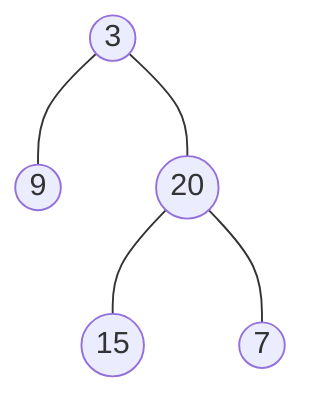
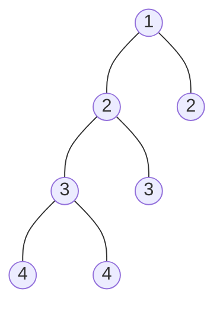

# Balanced Binary Tree

- **Difficulty:** Easy
- **Categories:** Tree, Depth-First Search, Binary Tree
- **Time Complexity:** $\mathcal{O}(N)$
- **Space Complexity:** $\mathcal{O}(H)$

---

## Problem Statement

Given a binary tree, determine if it is **height-balanced**.

A height-balanced binary tree is defined as:
> A binary tree in which the left and right subtrees of *every* node differ in height by no more than 1.

---

### Examples

**Example 1:**

- **Input:** `root = [3,9,20,null,null,15,7]`
- **Output:** `true`
- **Explanation:** The height of the left subtree of the root is 1, and the right subtree is 2. The difference is 1. All subtrees are also balanced.

**Example 2:**

- **Input:** `root = [1,2,2,3,3,null,null,4,4]`
- **Output:** `false`
- **Explanation:** The subtree rooted at node `2` on the left is unbalanced because its left child has height 2 (subtrees of 3) and its right child has height 0 (null).

---

### Constraints

- The number of nodes in the tree is in the range `[0, 5000]`.
- $-10^4 \le \text{Node.val} \le 10^4$

---

## Approach 1: Bottom-Up DFS with Height Difference Tracking

This approach computes the height of each node bottom-up recursively. While calculating the subtree heights, we maintain a reference variable `mx` that records the maximum absolute height difference seen between any left and right subtree in the entire tree.

### Algorithm
1. Recursively find the height of the left subtree (`leftDepth`) and the right subtree (`rightDepth`).
2. Update the maximum difference: `mx = max(mx, abs(leftDepth - rightDepth))`.
3. Return the height of the current subtree: `max(leftDepth, rightDepth) + 1`.
4. If `mx > 1` after traversing the tree, the tree is unbalanced.

See implementation in [dfs_height_diff.cpp](file:///Users/abhishekkumar/.gemini/antigravity/scratch/coding/dsa-wiki/balanced-binary-tree/dfs_height_diff.cpp).

---

## Approach 2: Optimized Bottom-Up DFS (Early Termination)

Instead of updating a global/reference variable, we can optimize the bottom-up traversal by propagating `-1` upward as soon as an unbalanced subtree is detected. This allows the recursion to "short-circuit" and terminate early without traversing the rest of the tree.

### Algorithm
1. Recursively check the height of the left and right subtrees.
2. If either call returns `-1`, propagate `-1` upward immediately.
3. If the absolute difference between `leftHeight` and `rightHeight` is greater than 1, return `-1`.
4. Otherwise, return the actual height of the current subtree: `max(leftHeight, rightHeight) + 1`.

See implementation in [optimized_bottom_up_dfs.cpp](file:///Users/abhishekkumar/.gemini/antigravity/scratch/coding/dsa-wiki/balanced-binary-tree/optimized_bottom_up_dfs.cpp).

---

## Complexity Analysis

- **Time Complexity:** $\mathcal{O}(N)$
  - For both approaches, we visit each node in the tree exactly once.
- **Space Complexity:** $\mathcal{O}(H)$
  - Where $H$ is the height of the tree, representing the maximum recursive call stack depth. In the worst case (skewed tree), $H = N$; in the best case (perfectly balanced tree), $H = \log_2 N$.

---

## Learn More

- [LeetCode #110 - Balanced Binary Tree](https://leetcode.com/problems/balanced-binary-tree/)
- [NeetCode - Balanced Binary Tree](https://neetcode.io/problems/balanced-binary-tree)
