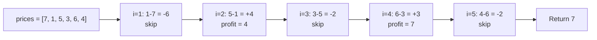
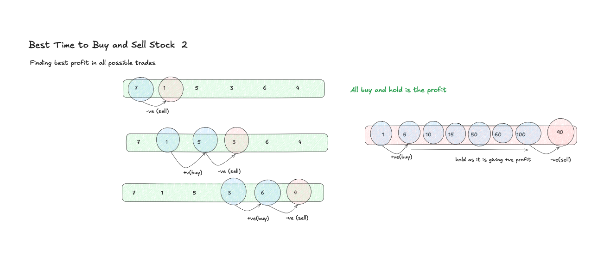

# Best Time to Buy and Sell Stock II - Explanation

You are given an array `prices` where `prices[i]` is the price of a stock on day `i`. You may buy and sell the stock **as many times as you want** (but you must sell before you buy again). Return the maximum profit achievable.

---

## Approach: Greedy (Collect Every Upward Slope)

### The Core Idea

Because there is no limit on the number of transactions, the optimal strategy is to **capture every positive price movement**. Whenever tomorrow's price is higher than today's, buy today and sell tomorrow.

This is equivalent to summing all positive consecutive differences:

```
profit = Σ max(prices[i] - prices[i-1], 0)  for i in [1, n-1]
```

**Why does this work?** Any multi-day gain can be decomposed into a chain of single-day gains. For example, buying on day 1 and selling on day 3 gives the same profit as buying on day 1, selling on day 2, buying on day 2, and selling on day 3.

### Algorithm Steps

1. Initialize `profit = 0`
2. Iterate `i` from `1` to `n - 1`
   - If `prices[i] >= prices[i-1]` → add the difference to `profit`
   - Otherwise → skip (no gain available)
3. Return `profit`

### Traversal Diagram



### Complexity
- **Time Complexity:** O(N) — single pass through the prices array
- **Space Complexity:** O(1) — only a running total is maintained

---

## Common Pitfalls

### 1. Thinking You Need to Track Buy/Sell Days
**Problem:** It feels like you need to explicitly decide *when* to buy and sell.  
**Fix:** You don't. The greedy decomposition proves that summing adjacent positive diffs gives the same result — no explicit trade tracking needed.

### 2. Using `>` Instead of `>=`
**Problem:** Skipping flat days (`prices[i] == prices[i-1]`) is fine since their contribution is zero, but using `>` is still correct — it just adds `0` unnecessarily with `>=`. Both work; `>` avoids the redundant addition.

### 3. Confusing with Stock I (Single Transaction)
**Problem:** Applying the one-pass min-price approach from Stock I here — it only captures one buy/sell window.  
**Fix:** Stock II allows unlimited trades; the greedy slope-collection strategy is the correct model.

---

## Visual Concept



---

## Learn More (External Resources)

- [NeetCode – Best Time to Buy and Sell Stock II](https://neetcode.io/problems/best-time-to-buy-and-sell-stock-ii)
- [LeetCode Problem #122](https://leetcode.com/problems/best-time-to-buy-and-sell-stock-ii/)
- [GeeksforGeeks Article](https://www.geeksforgeeks.org/stock-buy-sell/)
