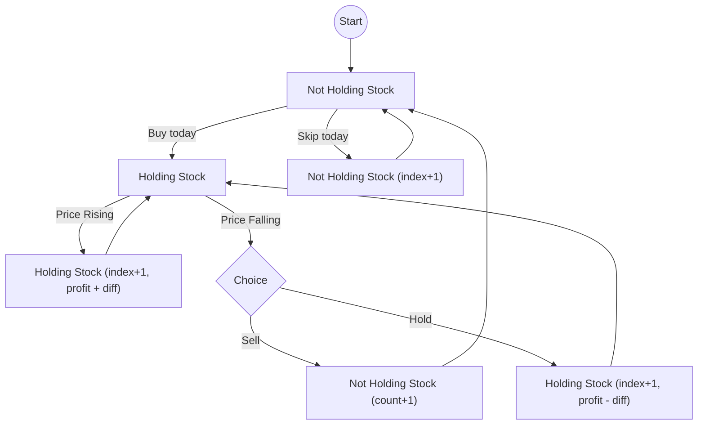
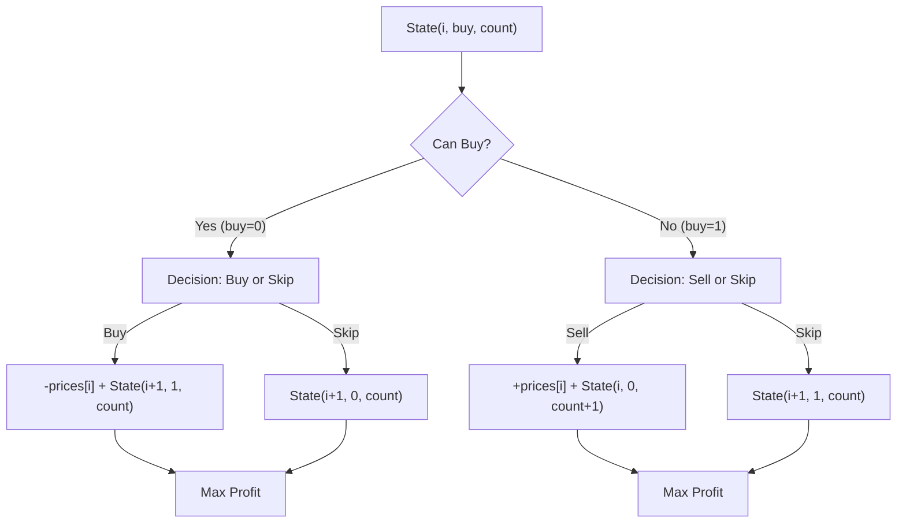

# Best Time to Buy and Sell Stock III

- **Difficulty:** Hard
- **Categories:** Array, Dynamic Programming
- **Time Complexity:** O(N) (with memoization) / O(2^N) (pure recursion)
- **Space Complexity:** O(N) (recursion depth)

---

## Problem Statement
You may complete at most two transactions. Return the maximum profit possible.

---

## Recursive Approach (State Machine)

The solution uses a recursive state machine to explore potential transactions. It tracks:
1. `index`: Current day.
2. `buy`: Whether we are currently holding a stock.
3. `profit`: Accumulated profit so far.
4. `count`: Number of completed transactions.

### State Transition Diagram

---

## Implementation details: 4-State DP

Track four states: buy1, sell1, buy2, sell2. Update: 
- `buy1 = max(buy1, -price)`
- `sell1 = max(sell1, buy1+price)`
- `buy2 = max(buy2, sell1-price)`
- `sell2 = max(sell2, buy2+price)`

---

## Top-Down DP (Memoization)

This approach uses a 3D DP table `dp[index][buy][count]` to cache results, reducing the time complexity from exponential to $O(N \times 2 \times 3) \approx O(N)$.

### DP State Definition
- **index**: The current day (0 to N-1).
- **buy**: 0 if we can buy (not holding), 1 if we can sell (holding).
- **count**: The number of transactions completed so far (0, 1, or 2).

### Decision Tree Diagram

---

## Learn More
- [NeetCode](https://neetcode.io/problems/best-time-to-buy-and-sell-stock-iii)
- [LeetCode](https://leetcode.com/problems/best-time-to-buy-and-sell-stock-iii/)
