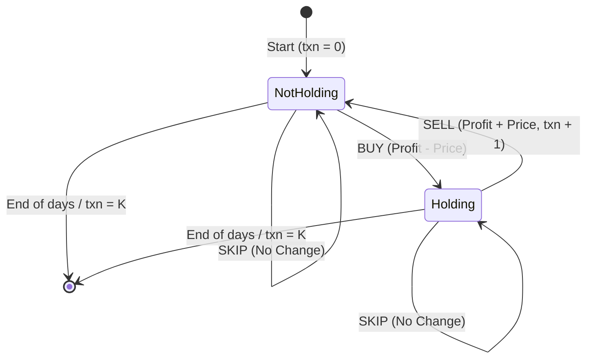
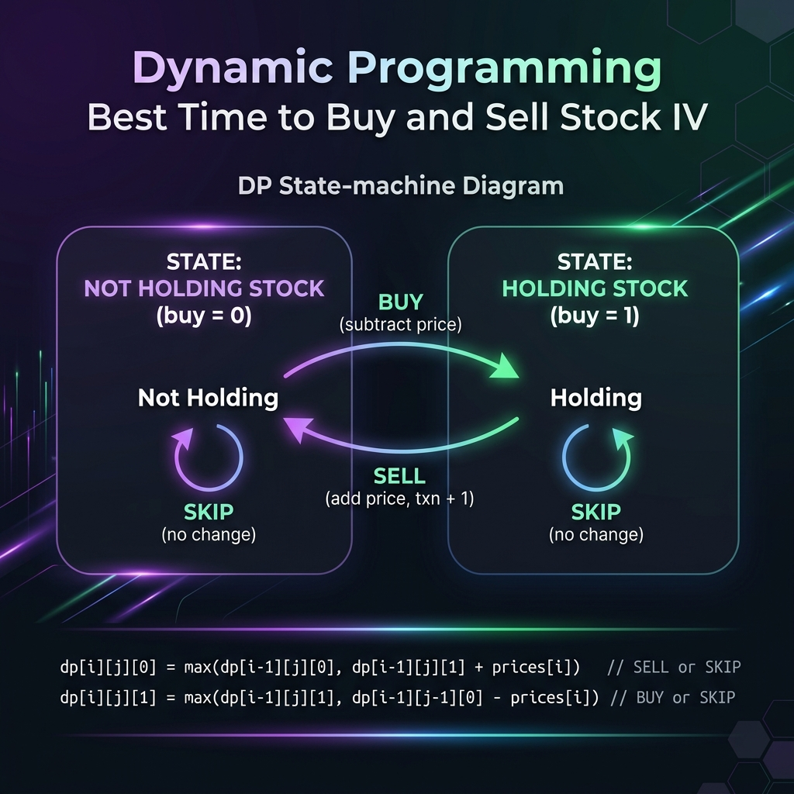

# Best Time to Buy and Sell Stock IV - Explanation

You are given an integer array `prices` where `prices[i]` is the price of a given stock on the `i-th` day, and an integer `k`.

Find the maximum profit you can achieve. You may complete at most `k` transactions.

**Note:** You may not engage in multiple transactions simultaneously (i.e., you must sell the stock before you buy again).

---

## Approaches

### Approach 1: Recursive Backtracking (Brute Force)
For each day, we make a binary choice depending on whether we currently hold a stock or not.
- **If Not Holding:** We can either **BUY** (transitioning to holding state and subtracting `prices[idx]` from profit) or **SKIP** (remaining in the not-holding state).
- **If Holding:** We can either **SELL** (transitioning to not-holding state, completing a transaction `txn + 1`, and adding `prices[idx]` to profit) or **SKIP** (remaining in the holding state).

*Complexity:*
- **Time Complexity:** `O(2^N)` where `N` is the number of days, due to exponential branching.
- **Space Complexity:** `O(N)` recursive call stack space.

---

### Approach 2: Top-Down Dynamic Programming (Memoization)
The recursive tree contains many overlapping subproblems where we evaluate the same index, transaction count, and buy/sell state multiple times. We optimize this by caching the results of each state in a 3D array `dp[idx][buy][txn]`.

#### DP State Transitions:
1. **State: Looking to Buy (`buy == 0`)**
   ```cpp
   dp[idx][0][txn] = max(-prices[idx] + solve(idx + 1, txn, 1), solve(idx + 1, txn, 0));
   ```
2. **State: Looking to Sell (`buy == 1`)**
   ```cpp
   dp[idx][1][txn] = max(prices[idx] + solve(idx + 1, txn + 1, 0), solve(idx + 1, txn, 1));
   ```

*Complexity:*
- **Time Complexity:** `O(N * K)` where `N` is the number of days and `K` is the maximum transaction limit. We compute each of the `N * 2 * K` states exactly once.
- **Space Complexity:** `O(N * K)` auxiliary space to store memoized results in our 3D `dp` table.

---

## DP State Machine Concept



---

## Visual Concept Diagram



---

## Common Pitfalls

### 1. Incorrect Memoization Size Constraints
**Problem:** Using array sizes that don't match input constraints. For instance, hardcoding `dp[1001][2][100]` can lead to segment faults if `k > 100` or `prices.size() > 1000`.  
**Fix:** Always ensure array sizes match LeetCode specifications or use a dynamic 3D `vector<vector<vector<int>>>` initialized with dimensions `(N, vector<vector<int>>(2, vector<int>(K, -1)))`.

### 2. Transaction Count Update Timing
**Problem:** Incrementing the transaction count `txn` on both BUY and SELL. A complete transaction consists of buying and selling.  
**Fix:** Only increment `txn` either specifically when you BUY or when you SELL. In our solution, we increment `txn` when we SELL: `txn + 1`.

---

## Learn More (External Resources)

- [NeetCode - Best Time to Buy and Sell Stock IV](https://neetcode.io/problems/best-time-to-buy-and-sell-stock-iv)
- [LeetCode Problem #188](https://leetcode.com/problems/best-time-to-buy-and-sell-stock-iv/)
- [GeeksforGeeks - Maximum profit by buying and selling a share at most k times](https://www.geeksforgeeks.org/maximum-profit-by-buying-and-selling-a-share-at-most-k-times/)

