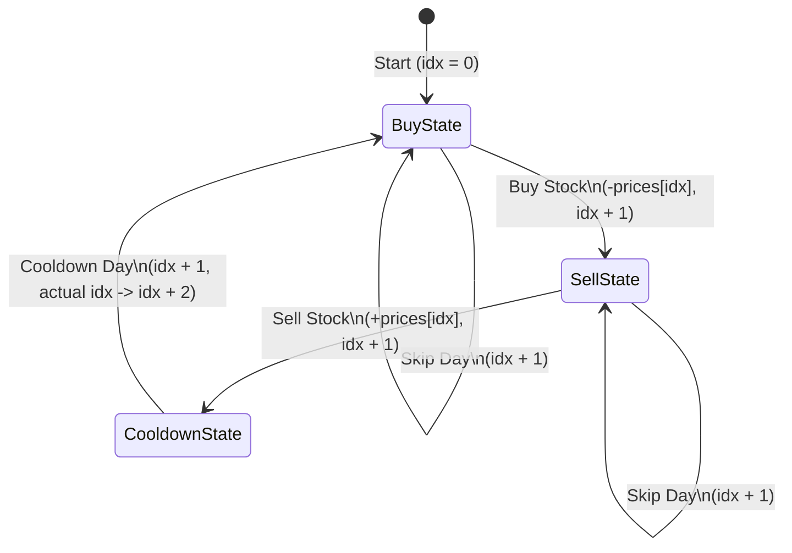

# Best Time to Buy and Sell Stock with Cooldown

You are given an array `prices` where `prices[i]` is the price of a given stock on the `i`-th day.

Find the maximum profit you can achieve. You may complete as many transactions as you like (i.e., buy one and sell one share of the stock multiple times) with the following restrictions:

- After you sell your stock, you cannot buy stock on the next day (i.e., cooldown one day).

**Note:** You may not engage in multiple transactions simultaneously (i.e., you must sell the stock before you buy again).

---

## Approach: Memoized Dynamic Programming (Top-Down)

### The Core Idea

The problem can be modeled as a decision tree where at each step (each day), we have a choice depending on our state (whether we hold a stock or not). To avoid redundant calculations in the recursion tree, we use a 2D cache `dp[idx][op]`:
- `idx` represents the current day.
- `op` (operation state) represents whether we are in a buying state (`op = 0`) or selling state (`op = 1`).

### State Transitions

1. **Buying State (`op == 0`)**:
   We can either:
   - **Buy**: Pay `prices[idx]` and transition to the selling state on the next day: `-prices[idx] + profit(prices, 1, idx + 1)`
   - **Skip**: Do nothing and stay in the buying state on the next day: `profit(prices, 0, idx + 1)`
   
   $$\text{dp}[idx][0] = \max(-\text{prices}[idx] + \text{profit}(idx + 1, 1), \text{profit}(idx + 1, 0))$$

2. **Selling State (`op == 1`)**:
   We can either:
   - **Sell**: Receive `prices[idx]` and transition to the buying state after a **1-day cooldown** (which means jumping to `idx + 2`): `prices[idx] + profit(prices, 0, idx + 2)`
   - **Skip**: Do nothing and stay in the selling state on the next day: `profit(prices, 1, idx + 1)`
   
   $$\text{dp}[idx][1] = \max(\text{prices}[idx] + \text{profit}(idx + 2, 0), \text{profit}(idx + 1, 1))$$

---

## Decision & State Flow

---

## Complexity

- **Time Complexity:** $O(N)$ — There are $N \times 2$ states, and each state takes $O(1)$ constant time to transition.
- **Space Complexity:** $O(N)$ — For the memoization table of size $N \times 2$, plus the call stack depth of $O(N)$.

---

## Common Pitfalls & Key Details

### 1. Cooldown Jump (`idx + 2`)
When we sell, the next buying opportunity can only happen on `idx + 2` because of the forced 1-day cooldown. Skipping this or using `idx + 1` is a common bug that violates the cooldown constraint.

### 2. Base Case Index Out of Bounds
Since we jump by `idx + 2` on selling, the recursive calls can exceed the bounds of the array. The base case must handle any `idx >= prices.size()` by returning `0` profit.

---

## Learn More

- [NeetCode - Best Time to Buy and Sell Stock with Cooldown](https://neetcode.io/problems/best-time-to-buy-and-sell-stock-with-cooldown)
- [LeetCode Problem #309](https://leetcode.com/problems/best-time-to-buy-and-sell-stock-with-cooldown/)
