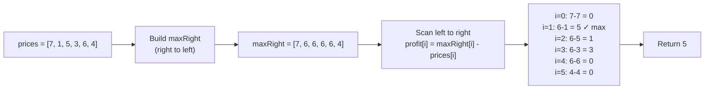
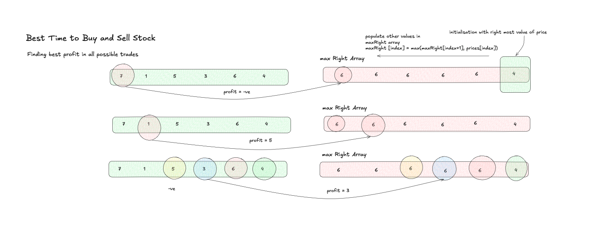

# Best Time to Buy and Sell Stock - Explanation

You are given an array `prices` where `prices[i]` is the price of a stock on the `i`-th day. You want to maximize profit by choosing a **single day to buy** and a **different future day to sell**. Return the maximum profit achievable; return `0` if no profit is possible.

---

## Approach 1: DP / Max-Right Array (O(N) space)

### The Core Idea

Pre-compute a `maxRight` array where `maxRight[i]` holds the **maximum price from day `i` to the end**. This tells us: *"if I buy today, what's the best price I can sell at?"*

Then a single left-to-right pass computes profit for each possible buy day:

```
profit[i] = maxRight[i] - prices[i]
```

Track the global maximum across all buy days.

### Algorithm Steps

1. Initialize `maxRight[n-1] = prices[n-1]` (rightmost element is its own max)
2. Fill **right-to-left**: `maxRight[i] = max(maxRight[i+1], prices[i])`
3. Scan **left-to-right**: `mx = max(mx, maxRight[i] - prices[i])`
4. Return `mx`

### Traversal Diagram



### Complexity
- **Time Complexity:** O(N) — two linear passes
- **Space Complexity:** O(N) — the `maxRight` auxiliary array

---

## Approach 2: One-Pass Greedy (O(1) space, optimal)

### The Core Idea

Track the **minimum price seen so far** as you scan left-to-right. At each day, compute `profit = prices[i] - minPrice` and update the max. This is equivalent to the DP approach but without the auxiliary array.

```cpp
int minPrice = INT_MAX, maxProfit = 0;
for (int price : prices) {
    minPrice   = min(minPrice, price);
    maxProfit  = max(maxProfit, price - minPrice);
}
return maxProfit;
```

### Complexity
- **Time Complexity:** O(N)
- **Space Complexity:** O(1)

---

## Common Pitfalls

### 1. Selling Before Buying
**Problem:** Allowing `sell day <= buy day` — the sell must happen *strictly after* the buy.  
**Fix:** The left-to-right scan naturally enforces this; `minPrice` is always from a day ≤ current day.

### 2. Returning Negative Profit
**Problem:** If prices only decrease, the best action is to not trade at all.  
**Fix:** Initialize `maxProfit = 0` (not `INT_MIN`) so no-trade is always a valid baseline.

### 3. maxRight Initialization
**Problem:** In the DP approach, starting the right-to-left fill at `i = n-1` (not `n`) is essential. Starting too early causes an out-of-bounds access.  
**Fix:** `maxRight[num - 1] = prices[num - 1];` then loop from `num - 2` down to `0`.

---

## Visual Concept



---

## Learn More (External Resources)

- [NeetCode – Best Time to Buy and Sell Stock](https://neetcode.io/problems/best-time-to-buy-and-sell-stock)
- [LeetCode Problem #121](https://leetcode.com/problems/best-time-to-buy-and-sell-stock/)
- [GeeksforGeeks Article](https://www.geeksforgeeks.org/best-time-to-buy-and-sell-stock/)
