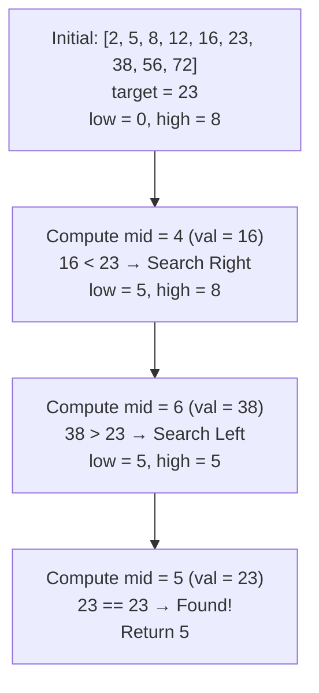
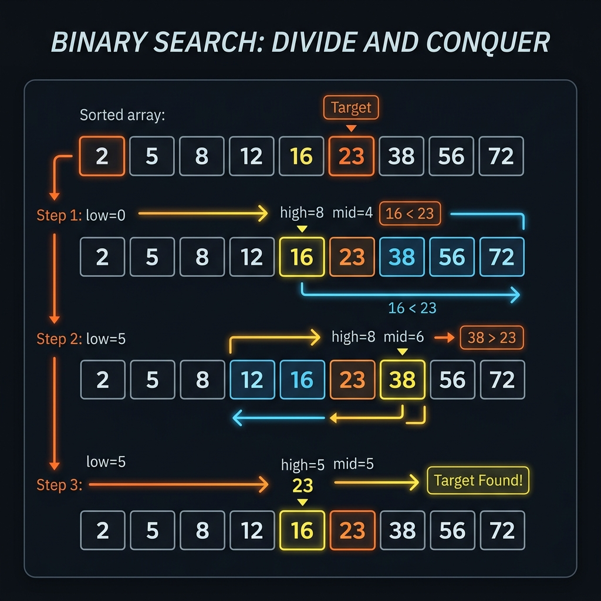

# Binary Search - Explanation

Given an array of integers `nums` which is sorted in ascending order, and an integer `target`, write a function to search `target` in `nums`. If `target` exists, then return its index. Otherwise, return `-1`.

You must write an algorithm with `O(log n)` runtime complexity.

---

## Approach: Classic Binary Search

### The Core Idea

Since the input array is sorted, we can use a **Divide and Conquer** strategy to eliminate half of the search space at each step. By keeping track of two boundary pointers, `low` and `high`, we compute the middle element `mid`.
- If the middle element matches the target, we return its index.
- If the middle element is larger than the target, then because the array is sorted, the target must reside in the left half. We update `high = mid - 1`.
- If the middle element is smaller than the target, the target must reside in the right half. We update `low = mid + 1`.

### Safe Mid Calculation

Instead of using the naive formula `mid = (low + high) / 2`, it is highly recommended to use:
```cpp
mid = low + (high - low) / 2;
```
This mathematically equivalent representation prevents **integer overflow** when `low + high` exceeds the maximum capacity of a signed 32-bit integer (`2,147,483,647`), which could cause a negative value and result in an out-of-bounds array access.

### Algorithm Steps

1. Initialize `low = 0` and `high = n - 1`.
2. Run a loop while `low <= high`:
   - Compute `mid = low + (high - low) / 2`.
   - If `nums[mid] == target`, return `mid` (Target found!).
   - If `nums[mid] > target`, update `high = mid - 1` (search left half).
   - If `nums[mid] < target`, update `low = mid + 1` (search right half).
3. If the loop terminates without finding the target, return `-1`.

### Traversal Diagram



### Complexity

- **Time Complexity:** O(log N) — in each step, the search range is halved.
- **Space Complexity:** O(1) — only a few integer pointers are used, modifying nothing in memory.

---

## Visual Concept



---

## Common Pitfalls

### 1. Integer Overflow in Mid Calculation
**Problem:** `(low + high) / 2` overflows when the sum exceeds the integer limits.  
**Fix:** Always use `low + (high - low) / 2`.

### 2. Incorrect Loop Termination Condition
**Problem:** Using `while (low < high)` instead of `while (low <= high)`. This will miss cases where the target is at the very last element being evaluated (where `low == high`).  
**Fix:** Always use `<=`.

### 3. Incorrect Pointer Updates
**Problem:** Setting `low = mid` or `high = mid` instead of `mid + 1` or `mid - 1`. This can lead to infinite loops when `low` and `high` are adjacent.  
**Fix:** Always shrink the search boundaries fully: `low = mid + 1` and `high = mid - 1`.

---

## Learn More (External Resources)

- [NeetCode - Binary Search](https://neetcode.io/problems/binary-search)
- [LeetCode Problem #704](https://leetcode.com/problems/binary-search/)
- [GeeksforGeeks - Binary Search](https://www.geeksforgeeks.org/binary-search/)

