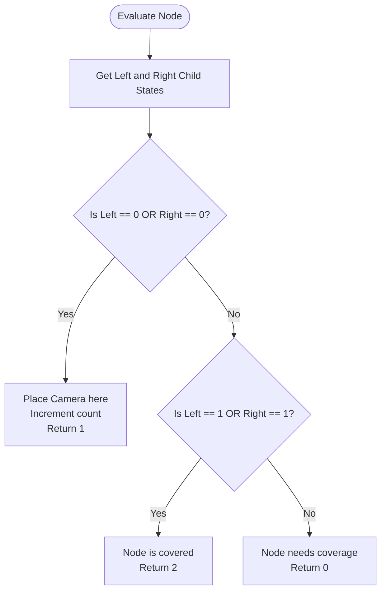
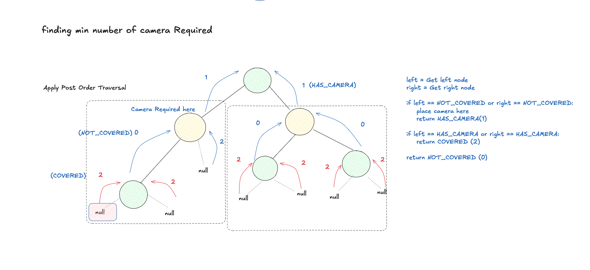

# Binary Tree Cameras

- **Difficulty:** Hard
- **Categories:** Dynamic Programming, Tree, Depth-First Search, Binary Tree, Greedy
- **Time Complexity:** $\mathcal{O}(N)$
- **Space Complexity:** $\mathcal{O}(H)$ where $H$ is the tree height

---

## Problem Statement

Given the `root` of a binary tree, we install cameras on the tree nodes. Each camera at a node can monitor its parent, itself, and its immediate children.

Return *the minimum number of cameras needed to monitor all nodes of the tree*.

---

## Approach: Greedy DFS (3 States)

The optimal way to solve this is using a **Greedy Depth-First Search (DFS)** with a post-order traversal (bottom-up approach).

### The Core Idea

To minimize the number of cameras, we should avoid placing cameras on leaf nodes. Placing a camera on a leaf node only covers the leaf and its parent (2 nodes max). If we place a camera on the parent of the leaf node, it can cover the leaf, the parent itself, the parent's sibling, and the parent's grandparent (up to 4 nodes).

Thus, we greedily place cameras as high up as possible by starting from the leaves and working our way up.

### The 3 Node States

Each node in the tree evaluates its children's states and returns one of three states to its parent:

1. **State 0: Needs Camera (`UNCOVERED`)**
   - The node is not covered by any camera. It needs its parent to place a camera to cover it.
2. **State 1: Has Camera (`CAMERA`)**
   - A camera has been placed at this node. This node covers itself, its children, and its parent.
3. **State 2: Covered (`COVERED`)**
   - The node is already covered by a camera at one of its children, or it is a `nullptr` node. It does not need a camera, and it doesn't have one itself.

### State Transitions and Logic

For any node, we first recursively query its left and right children:

- **Base Case:** If `root == nullptr`, we return **State 2 (Covered)**. This ensures that we do not mistakenly place cameras at empty leaf boundaries.
- **Case 1 (Must Place Camera):** If either the left or right child returns **State 0** (needs coverage), this current node **must** host a camera. We increment the camera count and return **State 1**.
- **Case 2 (Already Covered):** If either the left or right child returns **State 1** (has a camera), this current node is successfully covered by the child. We return **State 2**.
- **Case 3 (Uncovered):** If both children return **State 2** (covered but without cameras of their own), the current node is left uncovered. It must request its parent to cover it. We return **State 0**.

### Edge Case: The Root Node
At the end of the recursion, if the `root` node returns **State 0**, there is no parent to place a camera above it. Thus, we must place a camera directly at the `root` (increment count by 1).

---

## Visual State Decision Flow

---

## Complexity Analysis

- **Time Complexity:** $\mathcal{O}(N)$ where $N$ is the number of nodes in the binary tree. We visit each node exactly once.
- **Space Complexity:** $\mathcal{O}(H)$ where $H$ is the height of the tree, representing the recursion stack space. In the worst case (skewed tree), $H = \mathcal{O}(N)$; in the best case (balanced tree), $H = \mathcal{O}(\log N)$.

---

## Visual Concept

---

## Learn More

- [LeetCode #968 - Binary Tree Cameras](https://leetcode.com/problems/binary-tree-cameras/)
- [NeetCode - Binary Tree Cameras](https://neetcode.io/problems/binary-tree-cameras)
