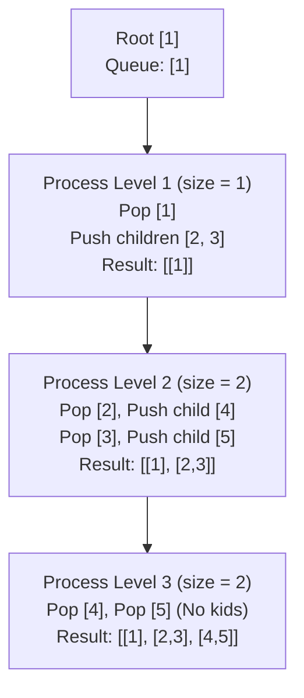
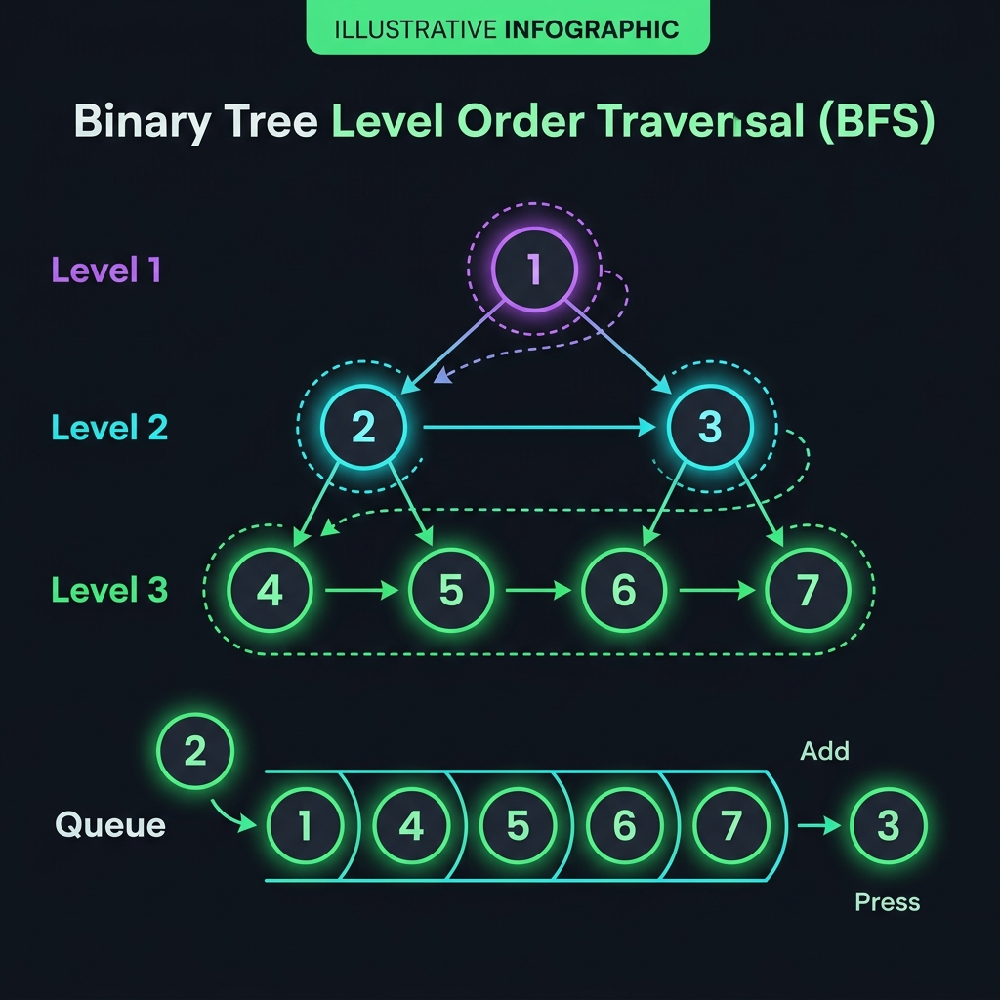

# Binary Tree Level Order Traversal - Explanation

Given the root of a binary tree, return the level order traversal of its nodes' values (i.e., from left to right, level by level).

---

## Approach: Breadth-First Search (BFS) with a Queue

### The Core Idea

Level-order traversal naturally maps to a **Breadth-First Search (BFS)** traversal. We traverse the tree level-by-level, starting from the root (Level 0), then its children (Level 1), their children (Level 2), and so on.

To process nodes level-by-level and group them into separate sub-arrays, we use a **Queue**. Before processing a level, we record the queue's size. That size represents exactly how many nodes are at that specific level. We pop exactly that many nodes, record their values, and push their children into the queue for the next level.

### Algorithm Steps

1. **Initialize**:
   - Create an empty 2D vector `result` to store the values of each level.
   - If the root is `nullptr`, return `result` immediately.
   - Initialize a queue `q` and push the `root` node.
2. **Level Traversal Loop** (runs while `q` is not empty):
   - Record the current queue size `currentItems = q.size()`. This is the exact number of nodes at the current level.
   - Create a temporary vector `currentLevelValues` to store values for this level.
   - **Process Level**: Loop exactly `currentItems` times:
     - Pop the front node `node` from the queue.
     - Add `node->val` to `currentLevelValues`.
     - If `node->left` is not null, push it to the queue.
     - If `node->right` is not null, push it to the queue.
   - Append `currentLevelValues` to `result`.
3. **Return** the `result`.

### Traversal Diagram

### Complexity

- **Time Complexity:** O(N) where N is the number of nodes in the binary tree. We visit and process every node exactly once.
- **Space Complexity:** O(N) to store the nodes in the queue. In a balanced binary tree, the last level contains roughly N/2 leaf nodes, so the queue size can reach O(N).

---

## Visual Concept

---

## Common Pitfalls

### 1. Hardcoding Level Traversal Without Level Sizes
**Problem:** A standard BFS queue pops and pushes elements continuously. If you do not freeze the size `q.size()` at the start of a level, you will process nodes from different levels in the same sub-array.  
**Fix:** Always declare `int currentItems = q.size();` before the inner loop and loop exactly `currentItems` times.

### 2. Not Handling the Null Root Case
**Problem:** Pushing a null root into the queue causes segmentation faults or null pointer dereferencing when attempting to read `node->val`.  
**Fix:** Always perform an early check: `if (root == nullptr) return result;`.

---

## Learn More (External Resources)

- [NeetCode - Binary Tree Level Order Traversal](https://neetcode.io/problems/binary-tree-level-order-traversal)
- [LeetCode Problem #102](https://leetcode.com/problems/binary-tree-level-order-traversal/)
- [GeeksforGeeks - Level Order Traversal of Binary Tree](https://www.geeksforgeeks.org/level-order-tree-traversal/)

