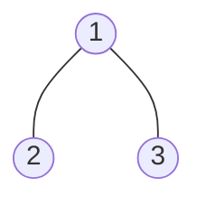
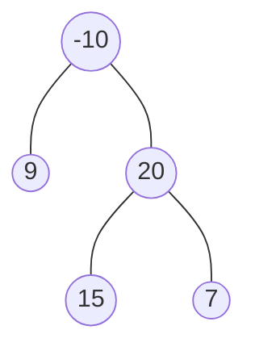
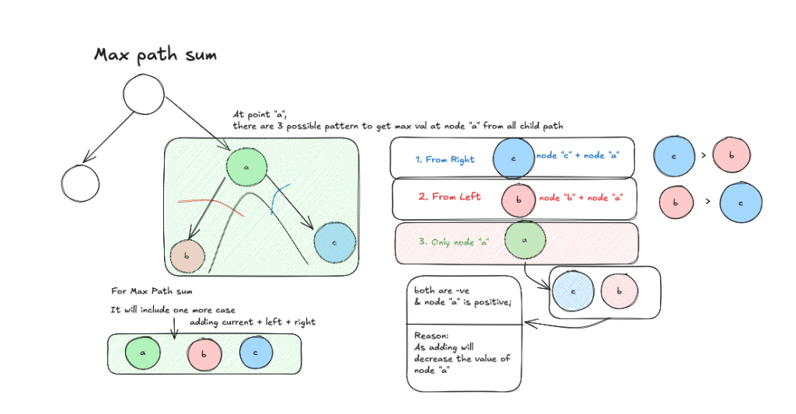

# Binary Tree Maximum Path Sum

- **Difficulty:** Hard
- **Categories:** Trees, Recursion, DFS, DP
- **Time Complexity:** O(N)
- **Space Complexity:** O(H)

---

A **path** in a binary tree is a sequence of nodes where each pair of adjacent nodes in the sequence has an edge connecting them. A node can only appear in the sequence at most once. Note that the path does not need to pass through the root.

The **path sum** of a path is the sum of the node's values in the path.

Given the `root` of a binary tree, return the maximum path sum of any non-empty path.

---

### Examples

**Example 1:**

- **Input:** `root = [1,2,3]`
- **Output:** `6`
- **Explanation:** The optimal path is `2 -> 1 -> 3` with a path sum of `2 + 1 + 3 = 6`.

**Example 2:**

- **Input:** `root = [-10,9,20,null,null,15,7]`
- **Output:** `42`
- **Explanation:** The optimal path is `15 -> 20 -> 7` with a path sum of `15 + 20 + 7 = 42`.

---

### Constraints
- The number of nodes in the tree is in the range `[1, 3 * 10^4]`.
- `-1000 <= Node.val <= 1000`

---

## Logic Explanation

The core insight is that for any node, the maximum path passing through it can be one of:
1. The node itself.
2. The node plus the maximum path from its left subtree.
3. The node plus the maximum path from its right subtree.
4. The node plus maximum paths from both subtrees (this path "arcs" through the node and cannot be extended further up to the parent).

### Recursive Approach
We use a recursive helper function `maxSum` that returns the maximum path starting from a node and going down into one of its children's subtrees. This value can be extended to the node's parent.

While calculating this, we also update a global maximum `mx` to account for paths that might arc through the current node (left + node + right).

### Complexity
- **Time Complexity:** $O(N)$ where $N$ is the number of nodes, as we visit each node exactly once.
- **Space Complexity:** $O(H)$ where $H$ is the height of the tree, representing the recursion stack depth.
