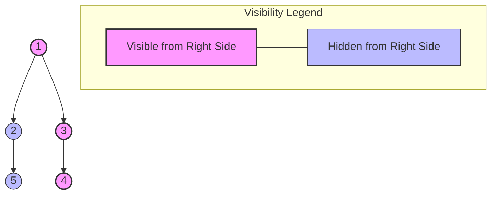

# Binary Tree Right Side View - Explanation

Given the root of a binary tree, imagine yourself standing on the right side of it. Return the values of the nodes you can see ordered from top to bottom.

- **Difficulty:** Medium
- **Categories:** Tree, Depth-First Search, Breadth-First Search, Binary Tree
- **Time Complexity:** O(N)
- **Space Complexity:** O(N)

---

## Approach: BFS Level Order (Last Node per Level)

### The Core Idea

Standing on the right side of a binary tree, you can only see the **rightmost** node at each level of the tree. Therefore, we can perform a standard **Breadth-First Search (BFS)** traversal (level-order) and collect the last node processed at each level.

Using a queue, we traverse level by level:
1. Before traversing a level, we retrieve the queue's size, `qSize`, which represents the exact number of nodes at that level.
2. We iterate `qSize` times.
3. The node popped at the very end of the iteration (`i == qSize - 1`) is the rightmost node of that level. We add its value to our `result` vector.
4. We push its non-null left and right child nodes to the queue for the next level.

This guarantees we process each level completely and identify the rightmost node.

### Visual Concept & Tree Visibility

### Algorithm Steps

1. **Initialize**:
   - Create a vector `result` to store the right side view values.
   - If `root` is `nullptr`, return the empty `result` immediately.
   - Initialize a queue `q` and push the `root` node.
2. **Level Traversal Loop** (runs while `q` is not empty):
   - Record the current level size `qSize = q.size()`.
   - **Process Level**: Loop from `i = 0` to `qSize - 1`:
     - Pop the front node `curr`.
     - If `i == qSize - 1`, we have reached the rightmost node of this level. Append `curr->val` to `result`.
     - Push `curr->left` to `q` (if non-null).
     - Push `curr->right` to `q` (if non-null).
3. **Return** `result`.

### Complexity

- **Time Complexity:** $O(N)$ where $N$ is the total number of nodes in the binary tree. We visit and process every node exactly once.
- **Space Complexity:** $O(W) = O(N)$ auxiliary space. The queue will store at most the maximum width of the tree $W$ at any time. In a balanced binary tree, this is at most $N/2$ leaf nodes at the deepest level.

---

## Common Pitfalls

### 1. Hardcoding Traversal Order (Ignoring Level Boundaries)
**Problem:** A naive queue traversal without separating levels will fail to track which node is the "last" node of a specific level.  
**Fix:** Always freeze the queue size `int qSize = q.size();` before running the inner level-processing loop.

### 2. Not Handling Null Root Case
**Problem:** Attempting to push a null root node onto the queue will lead to runtime errors when checking properties like `curr->val`.  
**Fix:** Start the function with an explicit check: `if (root == nullptr) return result;`.

### 3. Pushing Left/Right Children in Incorrect Order
**Problem:** For standard BFS, pushing `left` then `right` is the convention. If you mistakenly change this or try to only push `right` children, you will miss nodes that become visible on the right when right-hand subtrees are missing.  
**Fix:** Always push the `left` child first, then the `right` child, and let the level boundary iteration naturally identify the last element.

---

## Learn More (External Resources)

- [NeetCode - Binary Tree Right Side View](https://neetcode.io/problems/binary-tree-right-side-view)
- [LeetCode Problem #199](https://leetcode.com/problems/binary-tree-right-side-view/)
- [GeeksforGeeks - Print Right View of a Binary Tree](https://www.geeksforgeeks.org/print-right-view-binary-tree-2/)
