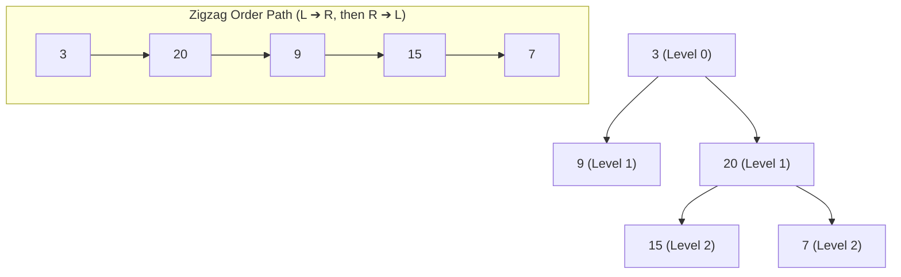

# Binary Tree Zigzag Level Order Traversal - Explanation

Given the root of a binary tree, return the zigzag level order traversal of its nodes' values (i.e., from left to right, then right to left for the next level and alternate between).

- **Difficulty:** Medium
- **Categories:** Tree, Breadth-First Search, Binary Tree
- **Time Complexity:** O(N)
- **Space Complexity:** O(N)

---

## Approach: Breadth-First Search (BFS) with a Queue & Level-based Directionality

### The Core Idea

The problem asks for a level-order traversal with alternating directions. Since we need to visit nodes level-by-level, this naturally fits a **Breadth-First Search (BFS)** traversal using a **Queue**. 

To handle the alternating (zigzag) order:
1. We keep track of the current level number (starting at `0` for the root level).
2. Before processing a level, we retrieve the queue's size, `qSize`, which represents exactly how many nodes reside on that level.
3. We allocate a vector of size `qSize` to store the level's values.
4. As we pop each node of the current level:
   - If the current level is **even** (e.g., Level 0, 2, ...), we store the node's value from **left-to-right**: `levelValues[i] = node->val`.
   - If the current level is **odd** (e.g., Level 1, 3, ...), we store the node's value in reverse order, **right-to-left**: `levelValues[qSize - 1 - i] = node->val`.
5. We push the non-null left and right child nodes to the queue for the next level.
6. After processing all nodes of the level, we increment the level count and append the level's vector to our final results.

This approach is highly optimized because we avoid reversing vectors after the level is populated. Instead, we insert values directly at their final positions using the level index indicator.

### Zigzag Traversal Flow Concept

### Algorithm Steps

1. **Initialize**:
   - Create a 2D vector `result` to store the level order traversal.
   - If `root` is `nullptr`, return the empty `result` list immediately.
   - Declare a queue `q` and push the `root` node.
   - Set `level = 0`.
2. **Level Traversal Loop** (runs while `q` is not empty):
   - Record the level size `qSize = q.size()`.
   - Initialize a vector `levelValues` of size `qSize`.
   - **Process Level**: Loop from `i = 0` to `qSize - 1`:
     - Pop the front node `curr`.
     - If `level % 2 == 0`, assign `levelValues[i] = curr->val`.
     - Else, assign `levelValues[qSize - 1 - i] = curr->val`.
     - Push children of `curr` (`left` first, then `right`) if they are not null.
   - Append `levelValues` to `result`.
   - Increment `level`.
3. **Return** `result`.

### Complexity

- **Time Complexity:** $O(N)$ where $N$ is the total number of nodes in the binary tree. We visit and process each node exactly once.
- **Space Complexity:** $O(N)$ auxiliary space. The queue will store at most the maximum number of nodes at any level, which is $O(N)$ in a balanced binary tree (specifically, at most $N/2$ leaf nodes at the deepest level).

---

## Common Pitfalls

### 1. Inefficient Level Reversal
**Problem:** Populating the level vector normally and then reversing it using `std::reverse` when `level % 2 != 0`. While this has the same asymptotic $O(N)$ complexity, it adds overhead by writing to memory twice.  
**Fix:** Pre-allocate the vector with size `qSize` and place the elements directly into their target indices (`i` or `qSize - 1 - i`) based on the direction flag.

### 2. Failing to Freeze the Level Size
**Problem:** Using `q.size()` directly inside the loop condition (e.g., `for (int i = 0; i < q.size(); i++)`). Since new children are being pushed onto the queue inside the loop, the queue's size changes dynamically, leading to incorrect grouping of levels.  
**Fix:** Always store `q.size()` in a static local variable `int qSize = q.size();` before entering the inner loop.

### 3. Null Pointer Dereferencing
**Problem:** Failing to verify that child pointers (`left` and `right`) are non-null before pushing them to the queue. Pushing null pointers will cause runtime segmentation faults when dereferencing them in subsequent iterations.  
**Fix:** Always guard queue insertions with conditional checks: `if (curr->left != nullptr) q.push(curr->left);`.

---

## Learn More (External Resources)

- [NeetCode - Binary Tree Zigzag Level Order Traversal](https://neetcode.io/problems/binary-tree-zigzag-level-order-traversal)
- [LeetCode Problem #103](https://leetcode.com/problems/binary-tree-zigzag-level-order-traversal/)
- [GeeksforGeeks - Zigzag Tree Traversal](https://www.geeksforgeeks.org/zigzag-tree-traversal/)
