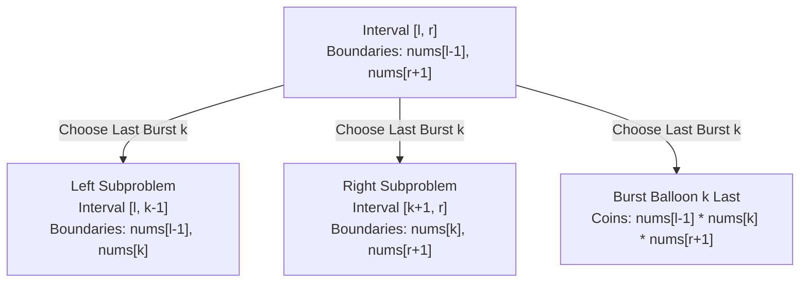
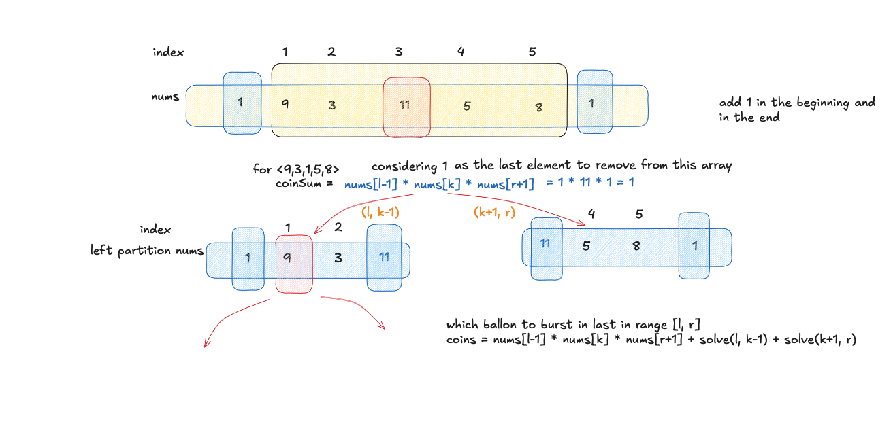

# Burst Balloons

- **Difficulty:** Hard
- **Categories:** Array, Dynamic Programming, Divide and Conquer
- **Time Complexity:** $\mathcal{O}(N^3)$
- **Space Complexity:** $\mathcal{O}(N^2)$

---

## Problem Statement

You are given $n$ balloons, indexed from $0$ to $n - 1$. Each balloon is painted with a number on it represented by an array `nums`. You are asked to burst all the balloons.

If you burst the $i$-th balloon, you will get `nums[i - 1] * nums[i] * nums[i + 1]` coins. Here, left and right are adjacent balloons of $i$. After the burst, the left and right balloons become adjacent.

Assume `nums[-1] = 1` and `nums[n] = 1` (out of bounds are treated as virtual balloons with value 1).

Return *the maximum coins you can collect by bursting the balloons wisely*.

---

## Approach: Interval DP (Last to Burst)

This problem is solved using **Interval Dynamic Programming**. 

### The Core Insight: Why "First to Burst" Fails
If we try to decide which balloon to burst *first* in an interval $[l, r]$, the boundary balloons of our subproblems change dynamically. For example, if we burst $k$ first, the balloons $k-1$ and $k+1$ now become adjacent. This creates a dependency on what happens *outside* the interval, making it impossible to decouple the subproblems.

### The Solution: "Last to Burst"
Instead of choosing the first balloon to burst, we choose the **last balloon $k$ to burst** in the interval $[l, r]$. 

If balloon $k$ is the last balloon to burst in $[l, r]$, this guarantees that:
1. All balloons in $[l, k-1]$ have already been burst.
2. All balloons in $[k+1, r]$ have already been burst.

Because all other balloons in $[l, r]$ are gone, the only remaining balloons adjacent to $k$ at the moment of its burst are $nums[l-1]$ (on the left) and $nums[r+1]$ (on the right). 

This allows us to split the problem into two completely independent subproblems:
- Left subproblem: Maximize coins by bursting $[l, k-1]$.
- Right subproblem: Maximize coins by bursting $[k+1, r]$.
- Last action: Burst balloon $k$, gaining $nums[l-1] \cdot nums[k] \cdot nums[r+1]$ coins.

### DP Recurrence Relation

Let $dp[l][r]$ be the maximum coins obtained by bursting all balloons in the interval $[l, r]$.

$$dp[l][r] = \max_{k=l}^{r} \left( nums[l-1] \cdot nums[k] \cdot nums[r+1] + dp[l][k-1] + dp[k+1][r] \right)$$

---

## Padded Array Visualization

To handle boundary conditions cleanly, we pad the array by inserting `1` at the beginning and appending `1` at the end:

```text
Original:      [  3,   1,   5,   8  ]
Padded:    [1,    3,   1,   5,   8,    1]
Indices:    0     1    2    3    4     5
          l-1   [ l                  r ]  r+1
```

For the full array, we solve for the interval $[1, n-2]$ in the padded array.

---

## Subproblem Division Flow

The following diagram illustrates how choosing $k$ as the last balloon to burst splits the interval $[l, r]$:



---

## Complexity Analysis

- **Time Complexity:** $\mathcal{O}(N^3)$
  - There are $\mathcal{O}(N^2)$ possible states/intervals $[l, r]$.
  - For each state, we iterate $k$ from $l$ to $r$ to find the optimal last balloon, which takes $\mathcal{O}(N)$ time.
  - Thus, the total time complexity is $\mathcal{O}(N^3)$.
- **Space Complexity:** $\mathcal{O}(N^2)$
  - The DP table of size $N \times N$ requires $\mathcal{O}(N^2)$ space.
  - The recursion call stack goes up to a maximum depth of $\mathcal{O}(N)$.

---

## Visual Concept



---

## Learn More

- [LeetCode #312 - Burst Balloons](https://leetcode.com/problems/burst-balloons/)
- [NeetCode - Burst Balloons](https://neetcode.io/problems/burst-balloons)
