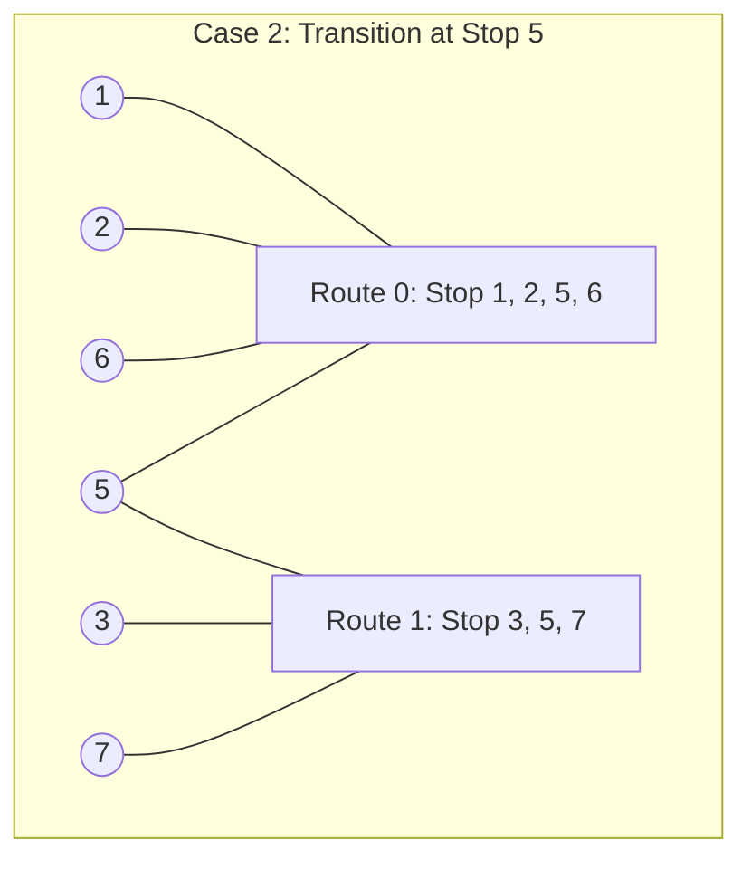

# Bus Routes

- **Difficulty:** Hard
- **Categories:** Array, Hash Table, Breadth-First Search
- **Time Complexity:** $\mathcal{O}(N \times M)$
- **Space Complexity:** $\mathcal{O}(N \times M)$

---

## Problem Statement

You are given an array `routes` representing bus routes where `routes[i]` is a bus route that the $i$-th bus repeats forever.
- For example, if `routes[0] = [1, 5, 7]`, this means that the $0$-th bus travels in the sequence `1 -> 5 -> 7 -> 1 -> 5 -> 7 -> 1 -> ...` forever.

You will start at the `source` stop (you are not on any bus initially), and you want to go to the `target` stop. You can travel between bus stops using the buses.

Return *the minimum number of buses you must take to travel from `source` to `target`*. If it is not possible to reach the target, return `-1`.

---

### Constraints

- $1 \le \text{routes.length} \le 500$
- $1 \le \text{routes}[i]\text{.length} \le 10^5$
- All the values of `routes[i]` are **unique**.
- $\sum \text{routes}[i]\text{.length} \le 10^5$
- $0 \le \text{routes}[i][j] < 10^6$
- $0 \le \text{source, target} < 10^6$

---

## Conceptual Explanation (BFS on Bus Routes vs. Stops)

When solving this problem, a naive approach might perform a Breadth-First Search (BFS) directly on **stops** (treating stops as graph nodes). However, because there can be up to $10^6$ stops, the graph of stops can become extremely large.

Instead, we perform a **BFS on Bus Routes (Buses)**.
- We treat each **bus route** as a node in our BFS graph.
- Two routes (nodes) are connected if they share at least one common bus stop.
- Finding the shortest path in this route-level graph gives the minimum number of buses needed.

### Core Data Structures

1. **Stop-to-Route Mapping (`stopToRoutes`)**: An adjacency list mapping each stop to all route indices that pass through it.
   $$\text{Stop} \longrightarrow \{\text{Route}_0, \text{Route}_1, \dots\}$$
2. **BFS Queue (`q`)**: A standard queue to store stops at the current BFS level.
3. **Visited Routes Set (`visitedRoutes`)**: A boolean flag array tracking which bus routes we have already boarded. This prevents us from traversing the same route twice (which would result in redundant work).
4. **Visited Stops Set (`visitedStops`)**: A set tracking which stops have been reached, ensuring we do not queue a stop more than once.

---

## Visualizing Transitions (Based on [concept.png](file:///Users/abhishekkumar/.gemini/antigravity/scratch/coding/dsa-wiki/bus-routes/concept.png))

Let's look at the two cases of route transitions described in `concept.png` to travel from **Source (1)** to **Target (7)**.

### Case 1: Transition at Stop 6
- **Stop-to-Route Map**:
  - $1 \longrightarrow [0]$
  - $2 \longrightarrow [0]$
  - $3 \longrightarrow [1]$
  - $5 \longrightarrow [0]$
  - $6 \longrightarrow [0, 1]$ (Intersection Stop!)
  - $7 \longrightarrow [1]$
- **Execution Flow**:
  1. **Level 1**: Queue contains `[1]`.
     - We board Route $0$ (since it passes through stop $1$).
     - Route $0$ takes us to stops `[1, 2, 5, 6]`. We add unvisited stops to queue: `[2, 5, 6]`.
  2. **Level 2**: Queue contains `[2, 5, 6]`.
     - When processing stop $6$, we find it intersects with Route $1$.
     - We board Route $1$.
     - Route $1$ takes us to stops `[3, 6, 7]`.
     - Stop $7$ matches our target!
     - **Result**: $2$ buses taken (Route $0 \to$ Route $1$).

---

### Case 2: Transition at Stop 5
- **Stop-to-Route Map**:
  - $1 \longrightarrow [0]$
  - $2 \longrightarrow [0]$
  - $3 \longrightarrow [1]$
  - $5 \longrightarrow [0, 1]$ (Intersection Stop!)
  - $6 \longrightarrow [0]$
  - $7 \longrightarrow [1]$
- **Execution Flow**:
  1. **Level 1**: Queue contains `[1]`.
     - We board Route $0$ (passes through stop $1$).
     - Route $0$ takes us to stops `[1, 2, 5, 6]`. Add unvisited stops to queue: `[2, 5, 6]`.
  2. **Level 2**: Queue contains `[2, 5, 6]`.
     - When processing stop $5$, we find it intersects with Route $1$.
     - We board Route $1$.
     - Route $1$ takes us to stops `[3, 5, 7]`.
     - Stop $7$ matches our target!
     - **Result**: $2$ buses taken (Route $0 \to$ Route $1$).

---

## Implementation

The solution is implemented using an optimized level-by-level BFS in C++.

See the full implementation here: [bfs_bus_routes.cpp](file:///Users/abhishekkumar/.gemini/antigravity/scratch/coding/dsa-wiki/bus-routes/bfs_bus_routes.cpp).

---

## Complexity Analysis

- **Time Complexity:** $\mathcal{O}(N \times M)$
  - Building the `stopToRoutes` mapping requires iterating through all stops in all routes. This takes $\mathcal{O}(\sum \text{routes}[i]\text{.length}) = \mathcal{O}(N \times M)$ where $N$ is the number of routes and $M$ is the average number of stops per route.
  - In the worst case, the BFS visits every stop and boards every bus route at most once. This also takes $\mathcal{O}(N \times M)$ time.
- **Space Complexity:** $\mathcal{O}(N \times M)$
  - Storing the `stopToRoutes` hash map requires storing all stops across all routes.
  - The queue and visited sets store at most $\mathcal{O}(N \times M)$ elements.

---

## Learn More

- [LeetCode #815 - Bus Routes](https://leetcode.com/problems/bus-routes/)
- [NeetCode - Bus Routes](https://neetcode.io/problems/bus-routes)
