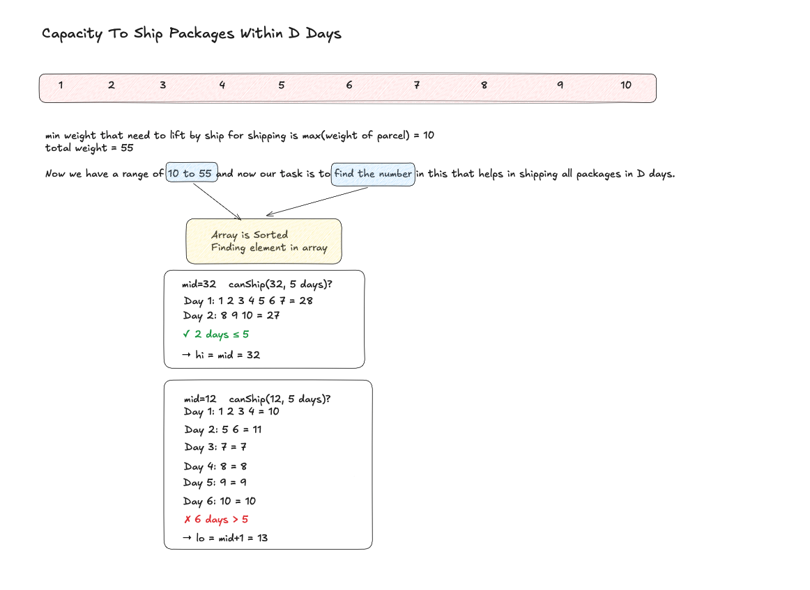

# Capacity To Ship Packages Within D Days



## Problem Statement
Given an array `weights` where `weights[i]` is the weight of the i‑th package, and an integer `days`, find the minimum ship capacity such that all packages can be shipped within `days`. Packages must be shipped in order; each day the ship loads a contiguous segment of packages whose total weight does not exceed the ship's capacity.

## Approach
The answer lies between the maximum single package weight (`max(weights)`) and the total sum of all weights. We binary‑search this range:
1. **Feasibility check (`canShip`)** – Simulate loading packages day by day; when the accumulated weight would exceed the candidate capacity, start a new day.
2. If the required days ≤ `days`, the capacity is sufficient, so we shrink the upper bound; otherwise we increase the lower bound.

The binary search converges to the minimal feasible capacity.

## Complexity Analysis
- **Time:** `O(n log S)` where `n` is `weights.size()` and `S` is the sum of weights (log of the search range).
- **Space:** `O(1)` – only a few integer variables are used.

## Reference Implementation (C++)
```cpp
class Solution {
public:
    bool canShip(const vector<int>& weights, int cap, int days) {
        int weightSum = 0, dayCount = 1;
        for (int w : weights) {
            if (weightSum + w > cap) {
                weightSum = 0;
                ++dayCount;
            }
            weightSum += w;
        }
        return dayCount <= days;
    }

    int shipWithinDays(const vector<int>& weights, int days) {
        int mx = 0, sum = 0;
        for (int w : weights) {
            sum += w;
            mx = max(mx, w);
        }
        int low = mx, high = sum;
        while (low < high) {
            int mid = low + (high - low) / 2;
            if (canShip(weights, mid, days))
                high = mid;
            else
                low = mid + 1;
        }
        return low;
    }
};
```