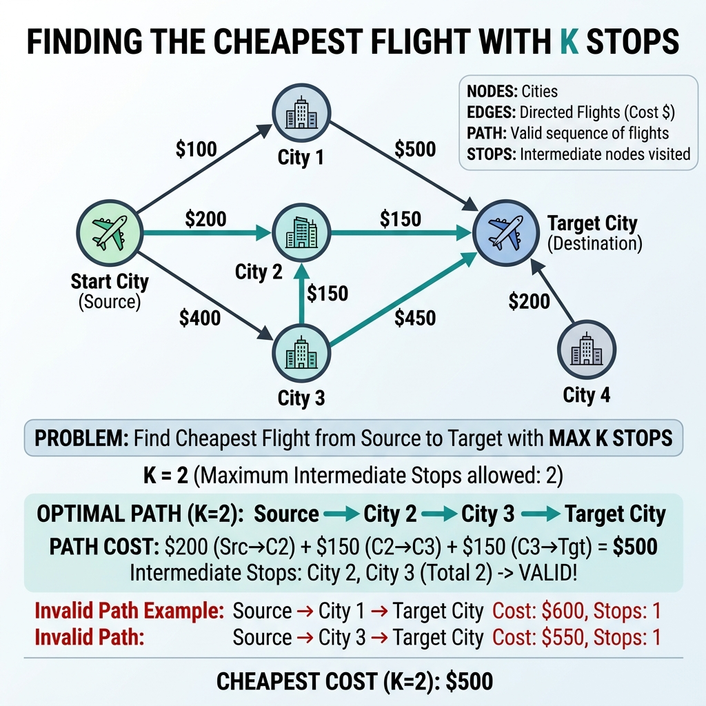

# Cheapest Flights Within K Stops

- **Difficulty:** Medium
- **Categories:** Graph, Shortest Path, BFS, DP, Heap
- **Time Complexity:** $\mathcal{O}(E \times K)$
- **Space Complexity:** $\mathcal{O}(V + E)$

---

## Problem Statement

Given `n` cities numbered from `0` to `n-1`, a list of flights where each flight is represented as `[from, to, price]`, a source city `src`, a destination city `dst`, and an integer `k` indicating the maximum number of **stops** allowed, find the cheapest price to travel from `src` to `dst` using **at most `k` stops**. If such a route does not exist, return `-1`.

---

## Visual Overview

The diagram illustrates several cities (nodes) connected by directed flights (edges) with associated costs. The goal is to find the cheapest path from the source to the destination while traversing no more than `k` intermediate stops.

---

## Approach

We perform a **level‑restricted BFS** (Breadth‑First Search) limited to `k+1` edges. The BFS explores all possible routes level by level, where each level corresponds to one additional stop. We maintain a map `price[city]` storing the cheapest known cost to reach each city so far. When a cheaper cost to a neighboring city is discovered, we update the map and enqueue the neighbor for the next level. This ensures we never exceed the stop limit while always considering the cheapest intermediate routes.

---

## Complexity Analysis

- **Time:** Each edge can be relaxed at most `k+1` times, giving `O(E × K)`.
- **Space:** The adjacency list stores `O(V + E)` and the BFS queue stores at most `O(V)` entries.

---

## Reference Implementation

See the C++ solution in [`cheapest_flights.cpp`](./cheapest_flights.cpp).

---

## Learn More

- [LeetCode – Cheapest Flights Within K Stops](https://leetcode.com/problems/cheapest-flights-within-k-stops/)
- [NeetCode – Cheapest Flights Video Explanation](https://neetcode.io/problems/cheapest-flights-within-k-stops)
