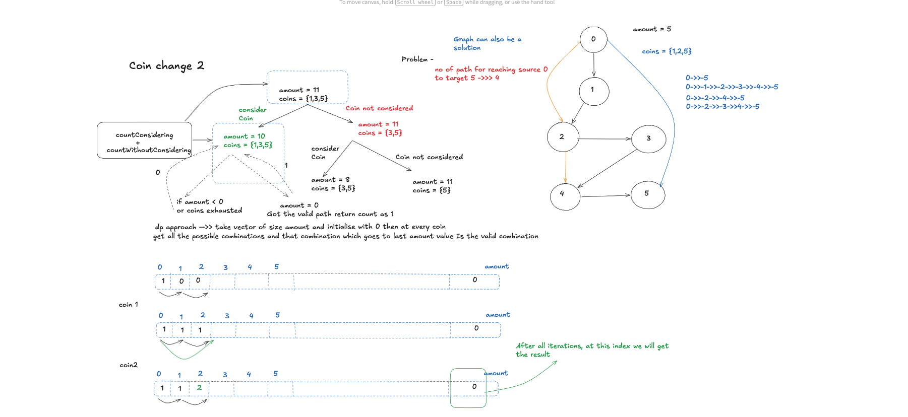

# Coin Change II

- **Difficulty:** Medium
- **Categories:** Array, Dynamic Programming

---

## Complexity Analysis

- **Time Complexity:** $O(\text{Amount} \times N)$
  - We iterate through each of the $N$ coins.
  - For each coin, we iterate through the DP array of size $\text{Amount} + 1$.
- **Space Complexity:** $O(\text{Amount})$
  - We use a 1D array of size $\text{Amount} + 1$ to store the number of ways to make each amount.

---

Return the number of combinations (not permutations) that make up the amount using given coin denominations.

---

## Approach: Unbounded Knapsack (Combinations)

dp[0]=1. For each coin, iterate amount from coin to target: dp[j] += dp[j-coin]. Outer loop on coins ensures combinations (not permutations).

---

## Related Interview Questions
- [Coin Change I (Minimum Coins)](../coin-change/README.md)
- [Partition Equal Subset Sum](../partition-equal-subset-sum/README.md)
- [Combination Sum IV](../combination-sum-iv/README.md)
- [Target Sum](../target-sum/README.md)

---

## Learn More
- [NeetCode](https://neetcode.io/problems/coin-change-ii)
- [LeetCode](https://leetcode.com/problems/coin-change-ii/)
