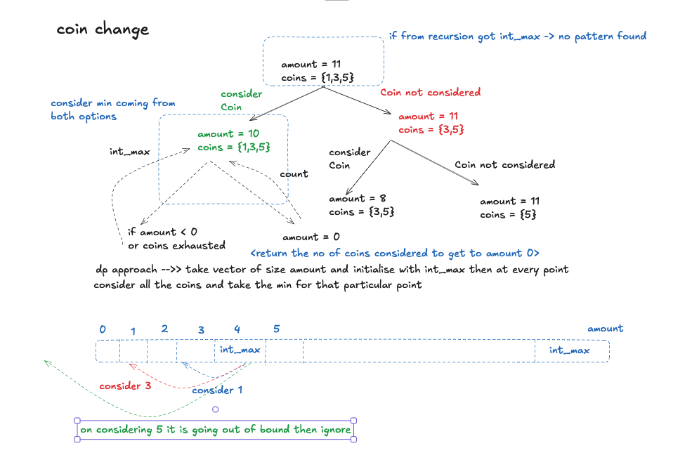

# Coin Change

- **Difficulty:** Medium
- **Categories:** Array, Dynamic Programming

---

## Complexity Analysis

- **Time Complexity:** $O(\text{Amount} \times N)$
  - We iterate through all amounts from 1 up to `amount`.
  - For each amount, we try all $N$ coin denominations.
- **Space Complexity:** $O(\text{Amount})$
  - We use a 1D array of size `amount + 1` to store the minimum coins for each amount.

---

Given an array of coin denominations `coins` and a total amount `amount`, return the fewest number of coins needed to make up that amount. If it cannot be made up, return `-1`.

*Visual representation of the dynamic programming approach, showing how smaller amounts build up to solve the total amount using the given coin denominations.*

---

## Approach: Bottom-Up Dynamic Programming

Build a `dp` array of size `amount + 1` initialized to infinity. Set `dp[0] = 0`. For each amount from 1 to `amount`, try every coin denomination and update `dp[i] = min(dp[i], dp[i - coin] + 1)`. Return `dp[amount]` if it's not infinity, else `-1`.

---

## Related Interview Questions
- [Coin Change II (Number of Ways)](../coin-change-ii/README.md)
- [Perfect Squares](../perfect-squares/README.md)
- [Minimum Cost for Tickets](../minimum-cost-for-tickets/README.md)
- [Combination Sum](../combination-sum/README.md)

---

## Learn More
- [NeetCode](https://neetcode.io/problems/coin-change)
- [LeetCode](https://leetcode.com/problems/coin-change/)
