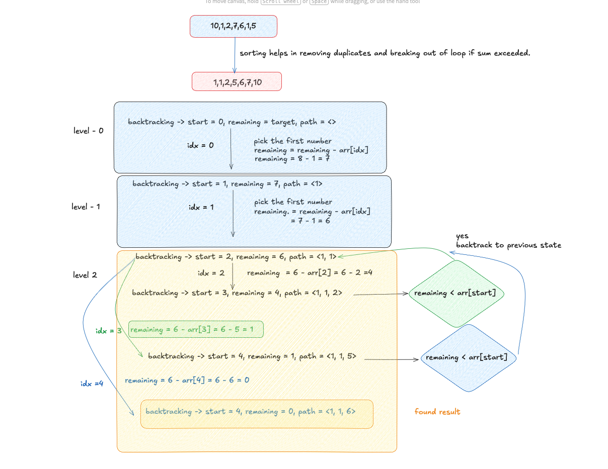

# Combination Sum II

**LeetCode #40** · [LeetCode](https://leetcode.com/problems/combination-sum-ii/) · [NeetCode](https://neetcode.io/problems/combination-sum-ii)

- **Difficulty:** Medium
- **Categories:** Array, Backtracking
- **Time Complexity:** O(2^N)
- **Space Complexity:** O(N)

---

## Problem Statement

Given a collection of candidate numbers (`candidates`) that **may contain duplicates** and a `target` integer, find all unique combinations where the chosen numbers sum to `target`. Each number in `candidates` may only be used **once** per combination, and the solution set must not contain duplicate combinations.

**Examples:**
```
Input: candidates = [10,1,2,7,6,1,5], target = 8
Output: [[1,1,6],[1,2,5],[1,7],[2,6]]

Input: candidates = [2,5,2,1,2], target = 5
Output: [[1,2,2],[5]]

Input: candidates = [1,1,1,1], target = 3
Output: [[1,1,1]]
```

---

## Intuition

Think of the search as a decision tree. At every level we pick the next candidate to add, and we recurse until the remaining budget hits zero (success) or a candidate exceeds it (prune). Because candidates can repeat, naive recursion would produce identical subtrees — e.g., picking the first `1` vs the second `1` leads to the same combinations.

The fix is to **sort** first (so duplicates sit side-by-side) and then **skip** any value at a given recursion level that equals the previous value we already explored at that same level. This collapses all duplicate subtrees into one without suppressing legitimate deeper uses of the same value. The sort also enables an **early break**: since the array is ascending, once a candidate exceeds the remaining budget every subsequent candidate will too.

---

## Approach: Backtracking with Sort + Sibling-Level Duplicate Skip

1. **Sort** `candidates` so duplicates are adjacent and early pruning is possible.
2. **Recurse** with a `start` index, a current combination `v`, and the `remaining` budget.
3. At each call, iterate from `start` upward:
   - **Skip** if `i > start && candidates[i] == candidates[i-1]` — duplicate at the same level.
   - **Break** if `candidates[i] > remaining` — no future candidate can help.
   - **Choose** → push → recurse with `i+1` (not `i`, so each element is used once) → **un-choose** → pop.
4. When `remaining == 0`, the combination is complete — record it.

```cpp
void backtrack(int start, vector<int>& v, int remaining,
               vector<int>& candidates, vector<vector<int>>& result) {
    if (remaining == 0) { result.push_back(v); return; }

    for (int i = start; i < candidates.size(); i++) {
        // Skip duplicate value at the same recursive depth (sibling pruning)
        if (i > start && candidates[i] == candidates[i-1]) continue;
        // Array is sorted — all further values also exceed budget
        if (candidates[i] > remaining) break;

        v.push_back(candidates[i]);
        backtrack(i + 1, v, remaining - candidates[i], candidates, result);
        v.pop_back();                    // restore for next sibling
    }
}
```

---

## Complexity

|           | Value   | Reason                                                                                       |
|-----------|---------|----------------------------------------------------------------------------------------------|
| **Time**  | O(2^N)  | Each element is either included or excluded — 2^N subsets in the worst case; sorting adds O(N log N) which is dominated |
| **Space** | O(N)    | Recursion stack depth bounded by N (one element consumed per frame); current path `v` also O(N) |

---

## Edge Cases

| Scenario                                        | Result                                                             |
|-------------------------------------------------|--------------------------------------------------------------------|
| Single candidate equals target `[7], 7`         | `[[7]]`                                                            |
| Single candidate exceeds target `[9], 5`        | `[]` — pruned immediately on the first iteration                   |
| All elements identical `[2,2,2], target=4`      | `[[2,2]]` — duplicate-skip collapses all three choices into one    |
| Target unreachable `[3,5,7], target=2`          | `[]` — every candidate > remaining on the first call               |
| Multiple duplicates in winning combo `[1,1,1,1], target=3` | `[[1,1,1]]` — only one distinct combination exists    |

---

## Alternative Approach

**Bitmask Enumeration — O(2^N · N)**

Enumerate all 2^N subsets via bitmask, collect those that sum to `target`, then deduplicate with a `set<vector<int>>`:

```cpp
set<vector<int>> seen;
sort(candidates.begin(), candidates.end());
for (int mask = 0; mask < (1 << n); mask++) {
    vector<int> combo; int sum = 0;
    for (int j = 0; j < n; j++)
        if (mask & (1 << j)) { combo.push_back(candidates[j]); sum += candidates[j]; }
    if (sum == target) seen.insert(combo);
}
```

Trade-off: strictly worse time and space; useful only as a brute-force correctness reference.

---

## Files

| File | Description |
|------|-------------|
| [`backtracking-sort-skip-duplicates.cpp`](./backtracking-sort-skip-duplicates.cpp) | C++ backtracking solution with sibling-level duplicate pruning and full inline comments |
| [`concept.png`](./concept.png) | Visual explanation of the decision tree and duplicate-skip pruning |



---

## Related Problems

- [Combination Sum (LC #39)](https://leetcode.com/problems/combination-sum/) — same backtracking template but no duplicates in input and each element can be reused unlimited times
- [Combination Sum III (LC #216)](https://leetcode.com/problems/combination-sum-iii/) — pick exactly k numbers from 1–9 that sum to n; same sort + skip pattern
- [Subsets II (LC #90)](https://leetcode.com/problems/subsets-ii/) — generate all unique subsets from a set with duplicates; uses the identical `i > start && a[i] == a[i-1]` guard
- [Permutations II (LC #47)](https://leetcode.com/problems/permutations-ii/) — unique permutations with duplicates; analogous skip logic applied to permutation backtracking
