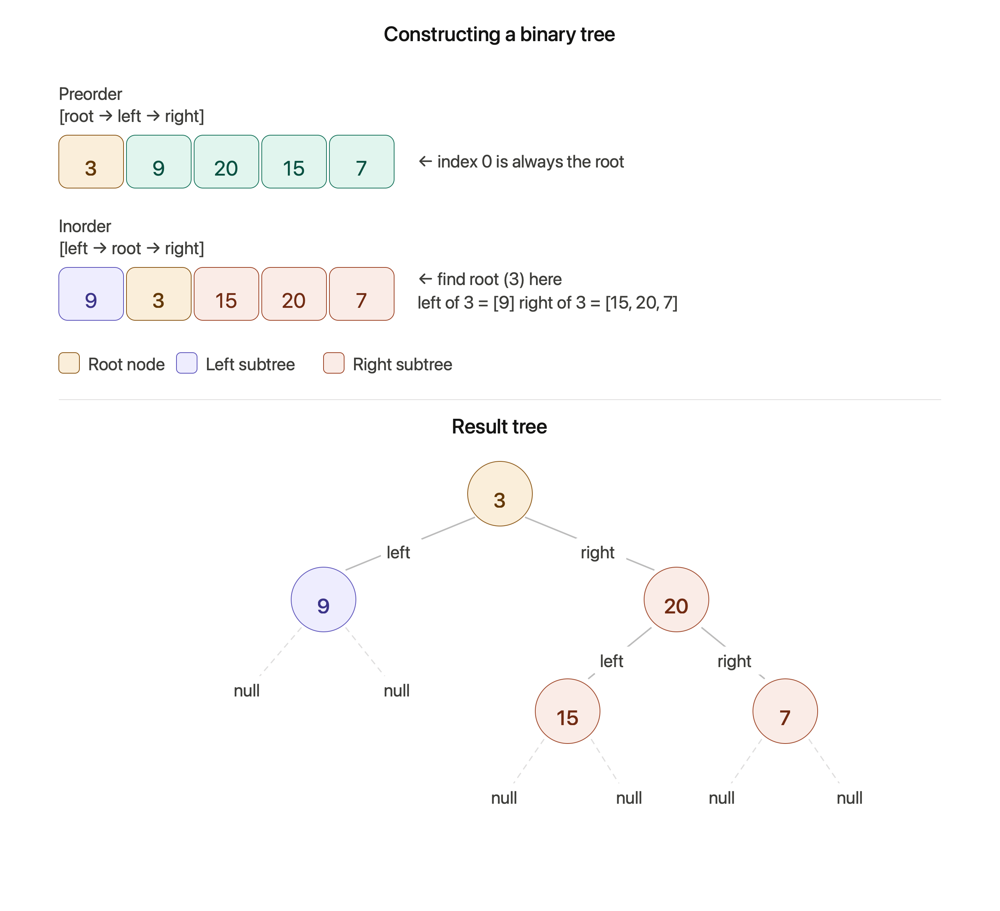

# Construct Binary Tree from Preorder and Inorder Traversal

**LeetCode #105** · [LeetCode](https://leetcode.com/problems/construct-binary-tree-from-preorder-and-inorder-traversal/) · [NeetCode](https://neetcode.io/problems/binary-tree-from-preorder-and-inorder-traversal)

- **Difficulty:** Medium
- **Categories:** Array, Hash Table, Divide and Conquer, Tree, Binary Tree
- **Time Complexity:** O(n)
- **Space Complexity:** O(n)

---

## Problem Statement

Given two integer arrays `preorder` and `inorder` where:
- `preorder` is the **preorder traversal** (root → left → right) of a binary tree
- `inorder` is the **inorder traversal** (left → root → right) of the same tree

Construct and return the binary tree.

**Examples:**
```
Input:  preorder = [3,9,20,15,7], inorder = [9,3,15,20,7]
Output: [3,9,20,null,null,15,7]

Input:  preorder = [-1], inorder = [-1]
Output: [-1]
```

---

## Intuition

Two traversals together uniquely identify a binary tree:

- **Preorder** always visits the **root first** — so `preorder[0]` is the overall root.
- **Inorder** visits left subtree, then root, then right subtree — so once we locate the root in the inorder array, everything to its **left** belongs to the left subtree and everything to its **right** belongs to the right subtree.

This gives a clean recursive structure: each call knows its root (from preorder) and its inorder bounds (the subarray it owns), and splits the problem into two strictly smaller subproblems.

The only performance concern is finding the root in the inorder array. A linear scan would make the overall algorithm O(n²). Precomputing a **hash map** `value → inorder index` makes every lookup O(1), keeping the total time O(n).



---

## Approach: Recursive Divide & Conquer + HashMap

1. **Preprocess** inorder into a map: `mp[value] = index`.
2. Maintain a global `idx` pointer into `preorder` (starts at 0). Each recursive call consumes exactly one preorder element.
3. Each call receives `[start, end]` — its slice of the inorder array.
   - Base case: `start > end` → return `NULL`.
   - Root = `preorder[idx++]`.
   - `pos = mp[root]` → splits inorder into left `[start, pos-1]` and right `[pos+1, end]`.
   - **Left subtree first** — this correctly advances `idx` through all left-subtree preorder values before moving to the right.

```
preorder = [3, 9, 20, 15, 7]
inorder  = [9, 3, 15, 20,  7]
            ↑  ↑   ↑   ↑   ↑
idx=0       root=3, pos=1 in inorder

Left subtree: inorder[0..0] = [9]   → preorder[1]=9  → leaf
Right subtree: inorder[2..4] = [15,20,7] → preorder[2]=20, pos=3
  Left of 20: inorder[2..2] = [15] → leaf
  Right of 20: inorder[4..4] = [7] → leaf
```

---

## Code

```cpp
class Solution {
public:
    int idx;                      // current position in preorder[]
    unordered_map<int, int> mp;   // inorder value → index for O(1) lookup

    TreeNode* buildBT(vector<int>& preorder, int start, int end) {
        if (start > end) return NULL;   // empty range → no node

        int rootValue = preorder[idx++];
        TreeNode* node = new TreeNode(rootValue);

        int pos = mp[rootValue];   // root's position in inorder

        // Build left subtree first — exhausts left portion of preorder
        node->left  = buildBT(preorder, start,   pos - 1);
        node->right = buildBT(preorder, pos + 1, end);

        return node;
    }

    TreeNode* buildTree(vector<int>& preorder, vector<int>& inorder) {
        idx = 0;
        for (int i = 0; i < (int)inorder.size(); i++)
            mp[inorder[i]] = i;

        return buildBT(preorder, 0, (int)preorder.size() - 1);
    }
};
```

---

## Complexity

|           | Value  | Reason |
|-----------|--------|--------|
| **Time**  | O(n)   | Each of the n nodes is created exactly once; map lookups are O(1) |
| **Space** | O(n)   | Hash map stores n entries; recursion stack is O(h), h ≤ n |

---

## Why Left Before Right Matters

The `idx` pointer moves through `preorder` in the exact order nodes are visited. Preorder is **root → left → right**, so after consuming the root, all left-subtree nodes come next in `preorder`. Building the left subtree first consumes exactly the right number of preorder elements before the right subtree starts — this is the crucial ordering guarantee.

---

## Edge Cases

| Scenario | Behaviour |
|---|---|
| Single node `[1], [1]` | Base case builds a single leaf |
| Left-skewed tree `[3,2,1], [1,2,3]` | Recursion depth = n; right subtrees are all empty |
| Right-skewed tree `[1,2,3], [1,2,3]` | Left subtrees are all empty |
| Negative values | Hash map handles any integer keys |
| All same values | Problem guarantees **unique** values — no ambiguity |

---

## Files

| File | Description |
|------|-------------|
| [`preorder-inorder-hashmap.cpp`](./preorder-inorder-hashmap.cpp) | C++ divide-and-conquer with O(1) inorder index lookup |
| [`binary_tree_construction_overview.png`](./binary_tree_construction_overview.png) | Diagram showing preorder/inorder array split and the resulting tree |

---

## Related Problems

- [LC #106 — Construct Binary Tree from Inorder and Postorder Traversal](https://leetcode.com/problems/construct-binary-tree-from-inorder-and-postorder-traversal/) — identical pattern; postorder's last element is the root
- [LC #889 — Construct Binary Tree from Preorder and Postorder Traversal](https://leetcode.com/problems/construct-binary-tree-from-preorder-and-postorder-traversal/) — similar but the result is not unique
- [LC #297 — Serialize and Deserialize Binary Tree](https://leetcode.com/problems/serialize-and-deserialize-binary-tree/) — encodes/reconstructs a tree from a single traversal with null markers
- [LC #108 — Convert Sorted Array to Binary Search Tree](https://leetcode.com/problems/convert-sorted-array-to-binary-search-tree/) — also builds a tree by recursive splitting of an array
