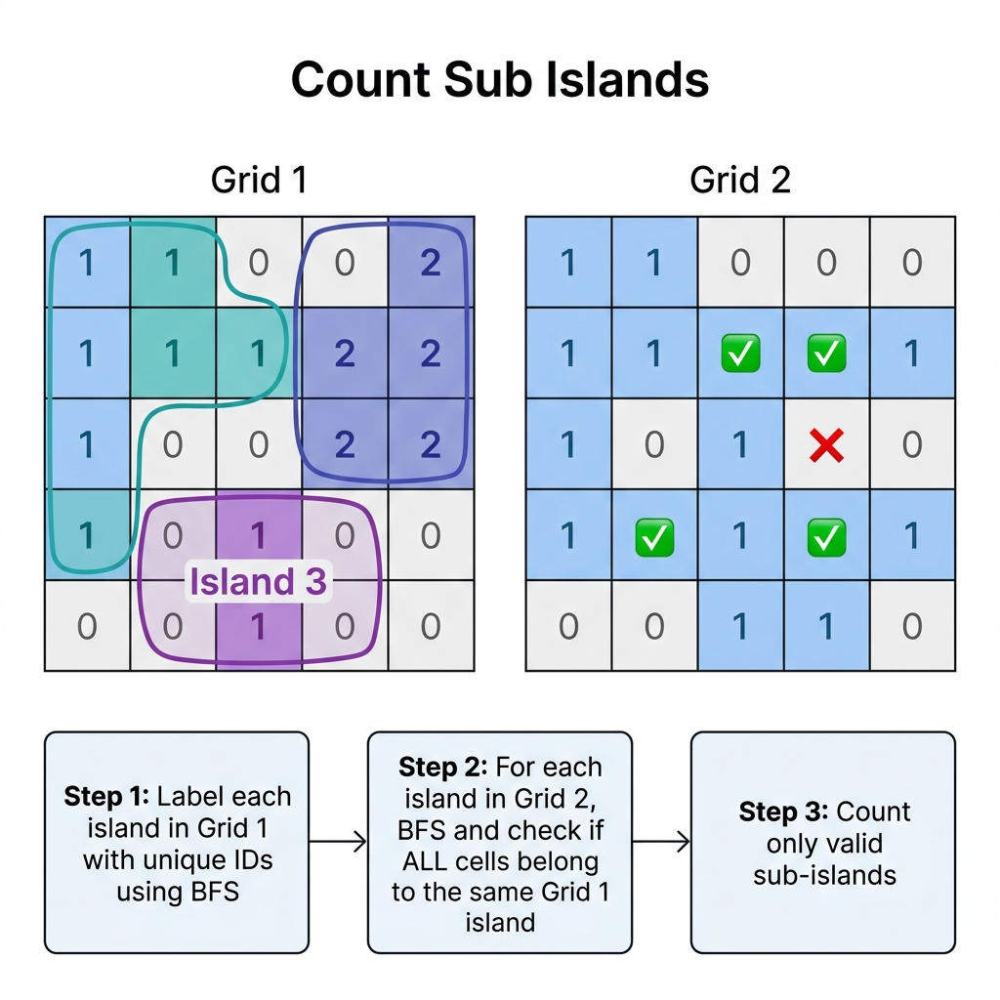

# Count Sub Islands

- **Difficulty:** Medium
- **Categories:** Array, Breadth-First Search, Matrix

---

## Complexity Analysis

- **Time Complexity:** $O(M \times N)$
  - Each cell in both grids is visited at most once across all BFS calls.
- **Space Complexity:** $O(M \times N)$
  - `visited` stores an integer island-ID per grid1 cell.
  - `gridVisited` stores a boolean flag per grid2 cell.
  - The BFS queue holds at most $O(M \times N)$ elements in the worst case.

---

An island in grid2 is a **sub-island** if every one of its land cells maps to land cells that all belong to the **same single island** in grid1.



---

## Approach: Two-Phase BFS

### Phase 1 — Label Islands in Grid 1

Iterate over every cell of grid1. Whenever an unvisited land cell is found, start a BFS that floods the entire connected component and stamps every cell with a **unique integer island ID** (stored in a separate `visited` matrix). After this phase, `visited[i][j]` equals `0` for water and `k` for land belonging to island `k`.

### Phase 2 — Validate Islands in Grid 2

Iterate over every cell of grid2. When an unvisited land cell is found **and** its corresponding grid1 cell already has an island ID (i.e., `visited[i][j] != 0`), launch a second BFS over the grid2 component. During the BFS, check whether every cell in the component carries the **same** island ID. If yes, it is a valid sub-island — increment the counter.

> **Key insight:** A grid2 island whose starting cell sits on water in grid1 (`visited == 0`) is skipped entirely before the BFS — it can never be a sub-island.

---

## Walkthrough Example

```
Grid 1              Grid 2
1 1 0 0 1     →    1 1 0 0 0
1 1 1 1 1          1 1 1 1 1
0 0 0 0 0          0 0 0 0 0
```

- Grid1 has **one** island (ID = 1) spanning all connected `1`s.
- Grid2 has **one** island. Every cell maps to island-1 in grid1 → **count = 1**.

---

## Related Interview Questions

- [Number of Islands](../number-of-islands/README.md)
- [Max Area of Island](../max-area-of-island/README.md)
- [Number of Enclaves](../number-of-enclaves/README.md)

---

## Learn More

- [NeetCode](https://neetcode.io/problems/count-sub-islands)
- [LeetCode](https://leetcode.com/problems/count-sub-islands/)
