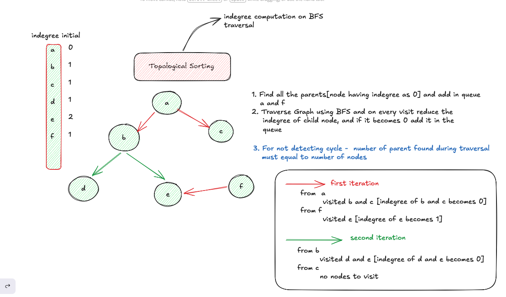

# Course Schedule

- **Difficulty:** Medium
- **Categories:** Graphs, Topological Sort, BFS
- **Time Complexity:** O(V + E)
- **Space Complexity:** O(V + E)

---

There are a total of `numCourses` courses you have to take, labeled from 0 to `numCourses - 1`. Some courses may have prerequisites. Determine if it is possible to finish all courses.

---

## Logic Explanation

This is a cycle detection problem in a directed graph. A popular way to solve this is by using **Topological Sorting** via Kahn's algorithm (BFS-based approach).

### Topological Sorting
1. Find all the parents [node having indegree as 0] and add in queue
2. Traverse Graph using BFS and on every visit reduce the indegree of child node, and if it becomes 0 add it in the queue
3. For not detecting cycle - number of parent found during traversal must equal to number of nodes

### Example Walkthrough (BFS Traversal)

**Initial Indegrees:**
- `a`: 0
- `b`: 1
- `c`: 1
- `d`: 1
- `e`: 2
- `f`: 0

Nodes `a` and `f` are our starting points (added to queue).

**1. First Iteration:**
- **From `a`:** Visited `b` and `c`. The indegree of `b` and `c` becomes 0.
- **From `f`:** Visited `e`. The indegree of `e` becomes 1.

**2. Second Iteration:**
- **From `b`:** Visited `d` and `e`. The indegree of `d` and `e` becomes 0.
- **From `c`:** No nodes to visit.

At the end of the traversal, since all nodes' indegrees reached 0 and they were processed, there are no cycles and the courses can be finished.

