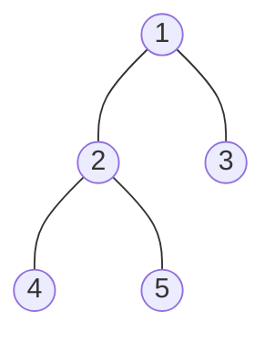
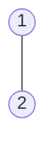
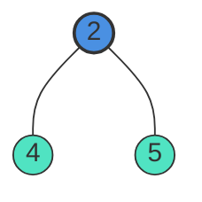

# Diameter of Binary Tree

- **Difficulty:** Easy
- **Categories:** Tree, Depth-First Search, Binary Tree
- **Time Complexity:** $\mathcal{O}(N)$
- **Space Complexity:** $\mathcal{O}(H)$

---

## Problem Statement

Given the `root` of a binary tree, return *the length of the **diameter** of the tree*.

The **diameter** of a binary tree is the **length of the longest path** between any two nodes in a tree. This path may or may not pass through the `root`.

The length of a path between two nodes is represented by the number of edges between them.

---

### Examples

**Example 1:**

- **Input:** `root = [1,2,3,4,5]`
- **Output:** `3`
- **Explanation:** `3` is the length of the path `[4,2,1,3]` or `[5,2,1,3]` (counted by edges: 4-2, 2-1, 1-3).

**Example 2:**

- **Input:** `root = [1,2]`
- **Output:** `1`

---

### Constraints

- The number of nodes in the tree is in the range `[1, 10^4]`.
- $-100 \le \text{Node.val} \le 100$

---

## Approach: Bottom-Up DFS (Post-Order Traversal)

The key insight is that for any node in the tree, the longest path that has this node as its highest point (the turning point) is the sum of the maximum depths of its left and right subtrees. 

By computing depths bottom-up (post-order traversal), we can:
1. Recursively find the height of the left subtree (`left`) and the height of the right subtree (`right`).
2. Calculate the potential diameter passing through the current node: `left + right`.
3. Update a global/reference maximum variable `mx` with this diameter value if it is larger than the current maximum.
4. Return the height of the current subtree to the parent: `max(left, right) + 1`.

### Visualization

For a subtree rooted at node `2`:

- `left` height (from `4`) = 1
- `right` height (from `5`) = 1
- Local diameter at `2` = `1 + 1 = 2` (path: `4 -> 2 -> 5`)

See implementation in [dfs.cpp](file:///Users/abhishekkumar/.gemini/antigravity/scratch/coding/dsa-wiki/diameter-of-binary-tree/dfs.cpp).

---

## Complexity Analysis

- **Time Complexity:** $\mathcal{O}(N)$
  - We visit each node in the tree exactly once to calculate heights, resulting in linear time complexity.
- **Space Complexity:** $\mathcal{O}(H)$
  - Where $H$ is the height of the tree, representing the recursion stack depth. In the worst case (completely skewed tree), $H = N$; in the average/best case (balanced tree), $H = \log_2 N$.

---

## Learn More

- [LeetCode #543 - Diameter of Binary Tree](https://leetcode.com/problems/diameter-of-binary-tree/)
- [NeetCode - Diameter of Binary Tree](https://neetcode.io/problems/diameter-of-binary-tree)
