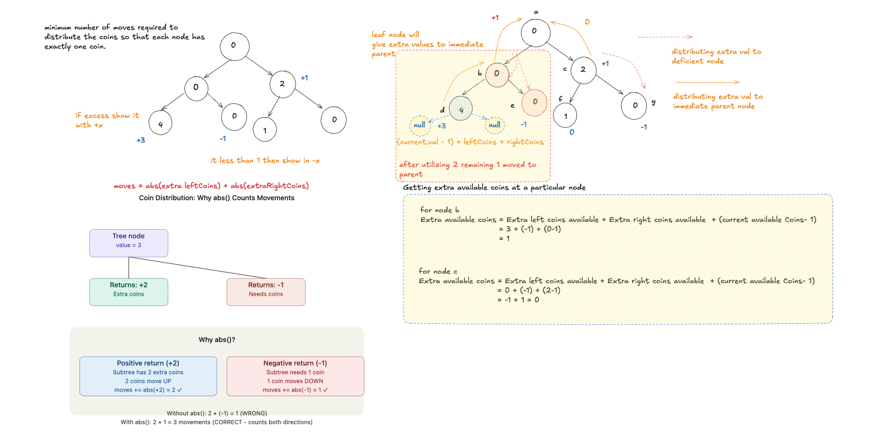

# Distribute Coins in Binary Tree

- **Difficulty:** Medium
- **Categories:** Tree, Depth-First Search, Binary Tree, Greedy

---

## Complexity Analysis

- **Time Complexity:** $O(N)$
  - We visit every node in the binary tree exactly once using a post-order traversal.
- **Space Complexity:** $O(H)$
  - The space complexity is determined by the recursion stack, which is proportional to the height $H$ of the tree. In the worst case (skewed tree), it could be $O(N)$.

---

Distribute coins so every node has exactly 1. Each move transfers one coin to adjacent node. Find minimum moves.

---

## Approach: DFS Excess Flow

Post-order DFS: return excess coins (positive=surplus, negative=deficit) from each subtree. Moves += abs(excess) for each subtree. Total moves = sum of all absolute excesses.

---

## Related Interview Questions
- [Binary Tree Maximum Path Sum](../binary-tree-maximum-path-sum/README.md)
- [Sum of Distances in Tree](../sum-of-distances-in-tree/README.md)
- [Diameter of Binary Tree](../diameter-of-binary-tree/README.md)
- [Smallest String Starting From Leaf](../smallest-string-starting-from-leaf/README.md)

---

## Learn More
- [NeetCode](https://neetcode.io/problems/distribute-coins-in-binary-tree)
- [LeetCode](https://leetcode.com/problems/distribute-coins-in-binary-tree/)
