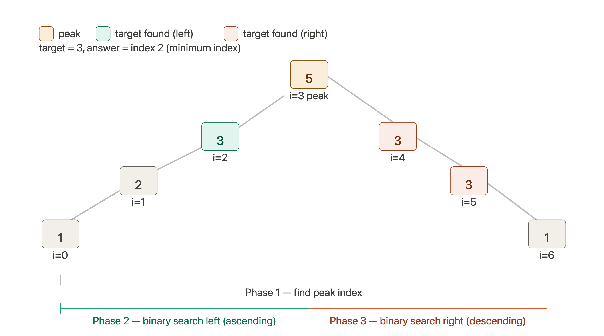

# Find in Mountain Array

**LeetCode #1095** · [LeetCode](https://leetcode.com/problems/find-in-mountain-array/) · [NeetCode](https://neetcode.io/problems/find-in-mountain-array)

- **Difficulty:** Hard
- **Categories:** Array, Binary Search, Interactive
- **Time Complexity:** `O(log N)`
- **Space Complexity:** `O(1)`

---

## Problem Statement

An array `A` is a **mountain array** if it satisfies the following properties:
- `A.length >= 3`
* There exists some `i` with `0 < i < A.length - 1` such that:
  - `A[0] < A[1] < ... < A[i - 1] < A[i]`
  - `A[i] > A[i + 1] > ... > A[A.length - 1]`

Given a mountain array `mountainArr` and a `target`, return the **minimum index** `index` such that `mountainArr.get(index) == target`. If such an index does not exist, return `-1`.

You cannot access the mountain array directly. You may only access the array using a `MountainArray` interface:
- `MountainArray.get(k)` returns the element of the array at index `k`.
- `MountainArray.length()` returns the length of the array.

Submissions making more than **100 calls** to `MountainArray.get` will be judged as *Wrong Answer*.

---

## Intuition

A linear search is ruled out due to the 100-call limit on `MountainArray.get()` for arrays up to size $10^4$. We must leverage **binary search**.

A mountain array consists of two monotonic halves split by a peak:
1. **Ascending half** (left of peak)
2. **Descending half** (right of peak)

If we know the index of the peak:
- We can search for the target in the ascending half. Since this half has smaller indices, any match found here is guaranteed to be the minimum index.
- If not found, we search the descending half.
- If still not found, the target does not exist in the array.

Thus, the problem decomposes into **three binary search phases**:
1. Find the peak index.
2. Search the ascending subarray.
3. Search the descending subarray.



---

## Approach

### 1. Finding the Peak
Using binary search to find the peak:
- Compare `mid` with `mid + 1`.
- If `A[mid] < A[mid + 1]`, we are on the incline. The peak must be to the right: `low = mid + 1`.
- If `A[mid] >= A[mid + 1]`, we are on the decline. The peak could be `mid` or to the left: `high = mid`.
- When `low == high`, we have converged on the peak index.

### 2. Searching the Ascending Subarray `[0, peak]`
Perform a standard binary search:
- If `A[mid] == target`, return `mid`.
- If `A[mid] < target`, search right: `low = mid + 1`.
- If `A[mid] > target`, search left: `high = mid - 1`.

### 3. Searching the Descending Subarray `[peak + 1, n - 1]`
Perform a reversed binary search (since elements decrease as index increases):
- If `A[mid] == target`, return `mid`.
- If `A[mid] < target`, search left: `high = mid - 1` (larger values are to the left).
- If `A[mid] > target`, search right: `low = mid + 1` (smaller values are to the right).

---

## Code

```cpp
class Solution {
public:
    int findInMountainArray(int target, MountainArray &mountainArr) {
        int n = mountainArr.length();
        int low = 0;
        int high = n - 1;
        
        // 1. Find peak index
        while (low < high) {
            int mid = low + (high - low) / 2;
            if (mountainArr.get(mid) < mountainArr.get(mid + 1)) {
                low = mid + 1;
            } else {
                high = mid;
            }
        }
        int peak = low;

        // 2. Binary search ascending half [0, peak]
        low = 0;
        high = peak;
        while (low <= high) {
            int mid = low + (high - low) / 2;
            int val = mountainArr.get(mid);
            if (val == target) return mid;
            else if (val < target) low = mid + 1;
            else high = mid - 1;
        }

        // 3. Binary search descending half [peak + 1, n - 1]
        low = peak + 1;
        high = n - 1;
        while (low <= high) {
            int mid = low + (high - low) / 2;
            int val = mountainArr.get(mid);
            if (val == target) return mid;
            else if (val > target) low = mid + 1;
            else high = mid - 1;
        }

        return -1;
    }
};
```

---

## Complexity

| | Value | Reason |
| :--- | :--- | :--- |
| **Time** | `O(log N)` | We perform three independent binary searches, each taking at most `O(log N)` steps. |
| **Space** | `O(1)` | Only a constant amount of extra helper variables are allocated. |
| **API Calls** | At most `3 * log2(N)` | For $N = 10^4$, each binary search makes at most $\approx 14$ calls. Total calls $\approx 42$, which easily satisfies the 100-call limit. |

---

## Edge Cases

| Scenario | Behavior |
| :--- | :--- |
| Target is at the peak | Found during the ascending search; returns `peak`. |
| Target not in the array | Ascending and descending searches both terminate with no match; returns `-1`. |
| Target exists in both halves | The ascending search completes first and returns the left index, satisfying the **minimum index** requirement. |
| Target is at index `0` or `n-1` | Boundary cases are correctly checked as ranges are inclusive (`low <= high`). |

---

## Files

| File | Description |
| :--- | :--- |
| [`three-pass-binary-search.cpp`](./three-pass-binary-search.cpp) | C++ solution using three-phase binary search |
| [`mountain_array_three_searches.png`](./mountain_array_three_searches.png) | Diagram showing peak search and ascending/descending binary searches |

---

## Related Problems

- [LC #852 — Peak Index in a Mountain Array](https://leetcode.com/problems/peak-index-in-a-mountain-array/) — simplified version (only phase 1)
- [LC #162 — Find Peak Element](https://leetcode.com/problems/find-peak-element/) — generic peak finding on unsorted arrays
- [LC #33 — Search in Rotated Sorted Array](https://leetcode.com/problems/search-in-rotated-sorted-array/) — binary search on shifted monotonic intervals
