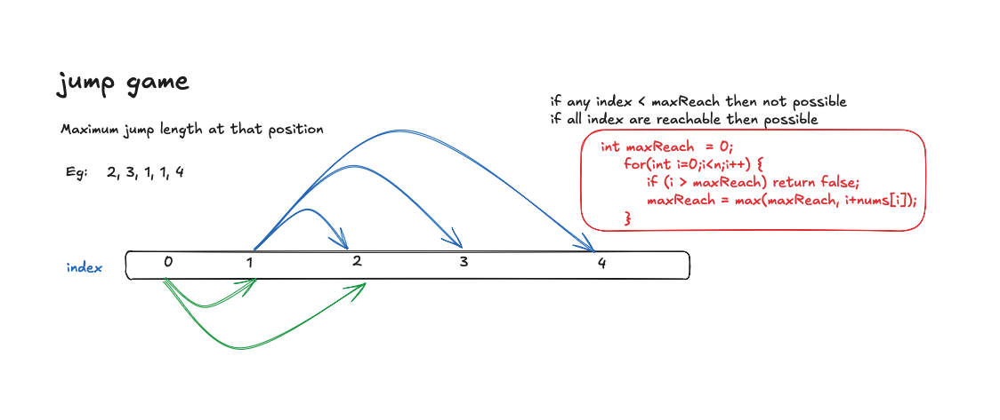

# Jump Game

You are given an integer array `nums`. You are initially positioned at the array's first index, and each element in the array represents your maximum jump length at that position. Determine if you are able to reach the last index.

## Approaches

### 1. Greedy (Optimal)
Use a greedy approach. Keep track of the maximum reachable index as you iterate through the array. If at any point the current index exceeds the maximum reachable index, return false.

- **Time Complexity**: O(n)
- **Space Complexity**: O(1)

---

### 2. Dynamic Programming
Create a boolean array `reach` initialized to `false`, where `reach[i]` signifies if we can arrive at index `i`. Set `reach[0] = true` and iterate over all elements. For each reachable index `i`, we examine all possible jump lengths `j` from `1` to `nums[i]`. We compute `currentIndex = i + j` and if it is within bounds, we mark `reach[currentIndex] = true`. If we reach the last index (`n - 1`), we return true early.

- **Time Complexity**: O(n^2), where `n` is the length of `nums`. In the worst case, we might perform up to `n` inner loop iterations for each outer loop step.
- **Space Complexity**: O(n), to store the boolean state array `reach`.
