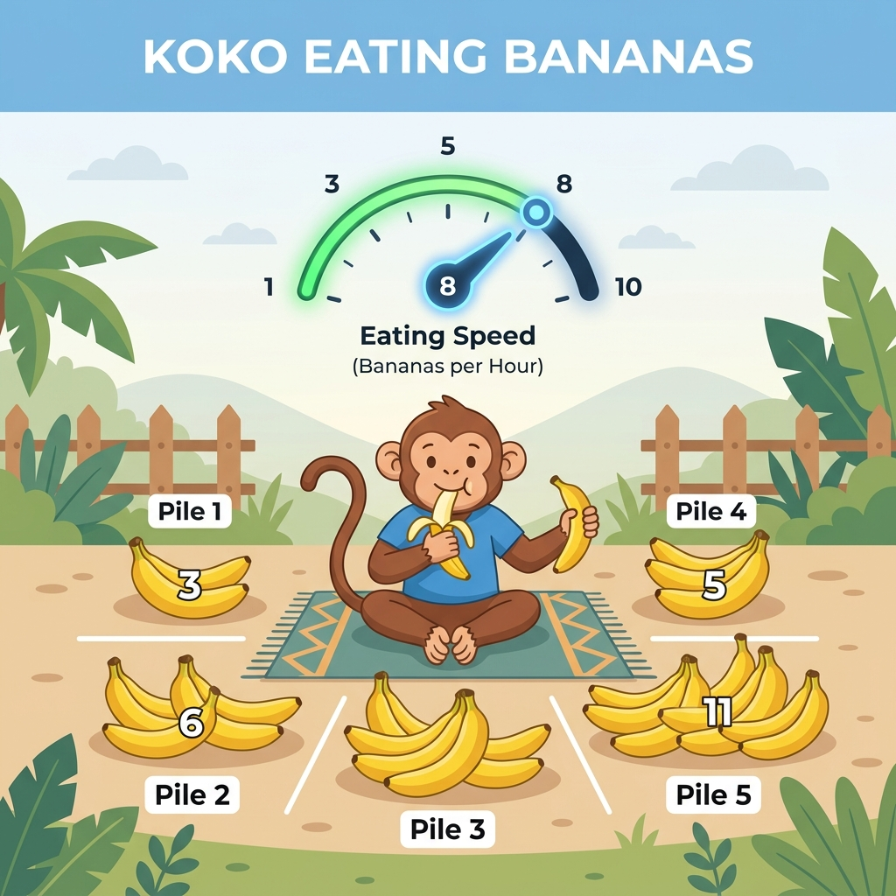

# Koko Eating Bananas

## Problem Description

Koko loves to eat bananas. There are `n` piles of bananas, the $i^{th}$ pile has `piles[i]` bananas. The guards have gone and will come back in `h` hours.

Koko can decide her bananas-per-hour eating speed of `k`. Each hour, she chooses some pile of bananas and eats `k` bananas from that pile. If the pile has less than `k` bananas, she eats all of them instead and will not eat any more bananas during this hour.

Koko likes to eat slowly but still wants to finish eating all the bananas before the guards return.

Return the minimum integer `k` such that she can eat all the bananas within `h` hours.

---

- **Difficulty:** Medium
- **Categories:** Array, Binary Search
- **Time Complexity:** $O(N \log M)$ where $N$ is the number of piles and $M$ is the maximum number of bananas in a pile.
- **Space Complexity:** $O(1)$

---

## Approaches

### 1. Brute Force (Linear Search)
Start from a theoretical minimum speed (e.g., `ceil(sum(piles) / h)`) and incrementally check every possible speed `k` up to the maximum pile size. For each speed, calculate the total hours required. The first speed that allows Koko to finish within `h` hours is the minimum valid speed.
- **Pros:** Conceptually simple.
- **Cons:** Extremely slow, especially when the maximum pile size is large. Results in a Time Limit Exceeded (TLE) error for large inputs.

### 2. Binary Search on Answer
Since the total hours required decreases monotonically as the eating speed `k` increases, we can apply Binary Search to find the minimum valid `k`.
1. **Search Space:** The minimum possible speed is `1`. The maximum speed Koko would ever need is `max(piles)` (eating faster than the largest pile doesn't save any more time because she can only eat from one pile per hour).
2. **Condition Checker:** Create a helper function `canEatBanana` that calculates the total hours needed at a given speed `k` and checks if it's $\le h$.
3. **Binary Search:** 
   - Find the middle speed `mid`.
   - If `canEatBanana` at speed `mid` is `true`, `mid` could be the answer, but try to find a smaller valid speed (search left: `high = mid`).
   - If `false`, Koko needs to eat faster (search right: `low = mid + 1`).

---

## Complexity Analysis

### Binary Search Approach
- **Time Complexity:** $O(N \log M)$
  - Getting the maximum element takes $O(N)$.
  - The binary search runs $O(\log M)$ times, where $M$ is the maximum pile size.
  - In each step of the binary search, we iterate over all $N$ piles to calculate the hours needed, taking $O(N)$ time.
  - Total time: $O(N) + O(N \log M) = O(N \log M)$.
- **Space Complexity:** $O(1)$
  - Only a few variables are used to maintain the binary search state and calculate hours, requiring constant extra space.

---

## Learn More
- [LeetCode](https://leetcode.com/problems/koko-eating-bananas/)
- [NeetCode](https://neetcode.io/problems/koko-eating-bananas)
