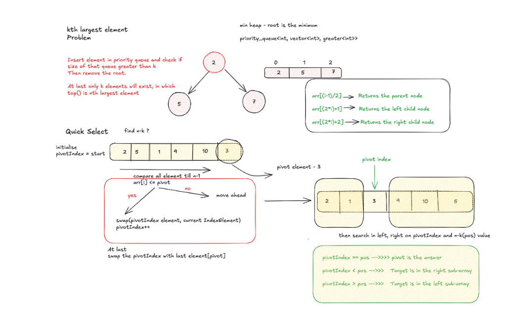

# Kth Largest Element in an Array

Given an integer array `nums` and an integer `k`, return the `kth` largest element in the array.

### Complexity
- **Time Complexity**: O(n log k) using a min-heap, or O(n) average using Quickselect.
- **Space Complexity**: O(k)

---
### Approach
Use a min-priority queue of size k to keep track of the k largest elements seen so far.

| Approach    | Time Complexity | Space | Best Use Case       |
| ----------- | --------------- | ----- | ------------------- |
| Sorting     | O(n log n)      | O(1)  | Simple cases        |
| Min Heap    | O(n log k)      | O(k)  | Streaming / large n |
| Max Heap    | O(n + k log n)  | O(n)  | Rarely used         |
| Quickselect | O(n) avg        | O(1)  | Best overall        |

Max Heap

priority_queue<int> pq;
pq.push(10);
pq.push(5);
pq.push(20);

cout << pq.top(); // 20

Min Heap
priority_queue<int, vector<int>, greater<int>> pq;
pq.push(10);
pq.push(5);
pq.push(20);

cout << pq.top(); // 5

### How is a Binary Heap represented?

A Binary Heap is a Complete Binary Tree. A binary heap is typically represented as an array.

The root element will be at `arr[0]`.

The below table shows indices of other nodes for the `i`th node, i.e., `arr[i]`:

| Expression | Description |
| :--- | :--- |
| `arr[(i-1)/2]` | Returns the parent node |
| `arr[(2*i)+1]` | Returns the left child node |
| `arr[(2*i)+2]` | Returns the right child node |

### Concept Diagram

