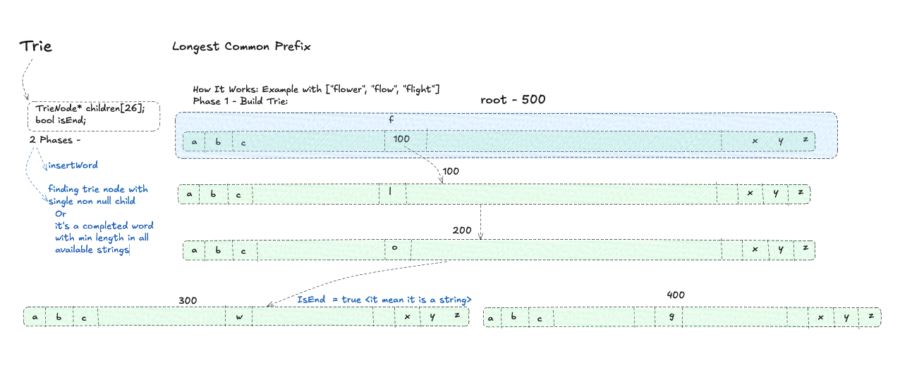

# Longest Common Prefix

- **Difficulty:** Easy
- **Categories:** String, Trie

---

## Complexity Analysis

- **Time Complexity:** $O(S)$
  - Building the Trie takes $O(S)$ time, where $S$ is the sum of all characters in all strings.
  - Finding the longest common prefix takes at most $O(M)$ time, where $M$ is the length of the longest common prefix. Therefore, the overall time complexity is $O(S)$.
- **Space Complexity:** $O(S)$
  - In the worst case, if all strings have no common prefix, the Trie will need to store all $S$ characters, taking $O(S)$ space.

---

Find the longest common prefix string among an array of strings.

---

## Approach: Trie

1. Insert all strings into a Trie data structure.
2. Traverse down the Trie starting from the root.
3. The common prefix stops when we reach a node that either has more than one child (meaning the strings diverge) or marks the end of a word (meaning one of the strings ends there).

---

## Related Interview Questions
- [Implement Trie (Prefix Tree)](../implement-trie-prefix-tree/README.md)
- [Design Search Autocomplete System](../design-search-autocomplete-system/README.md)
- [Replace Words](../replace-words/README.md)
- [Word Search II](../word-search-ii/README.md)

---

## Learn More
- [NeetCode](https://neetcode.io/problems/longest-common-prefix)
- [LeetCode](https://leetcode.com/problems/longest-common-prefix/)
