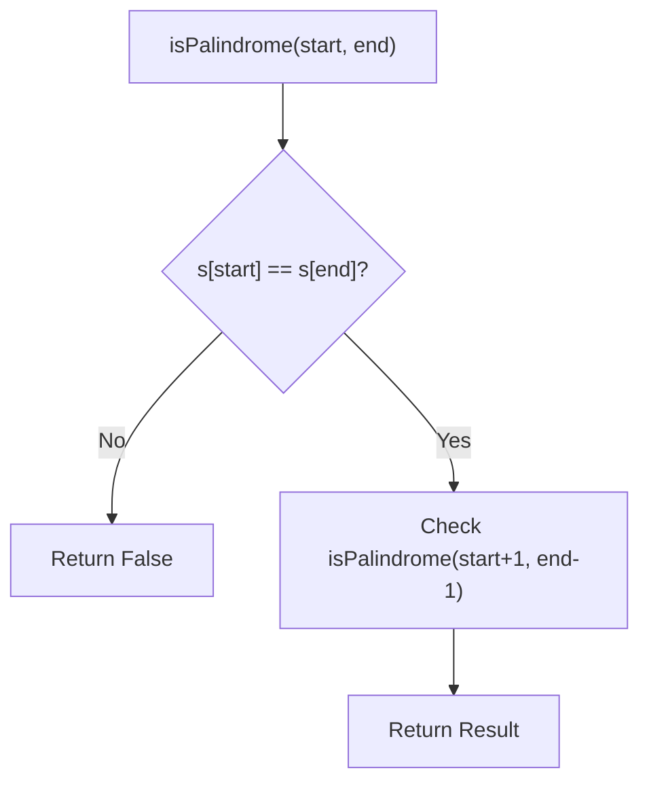
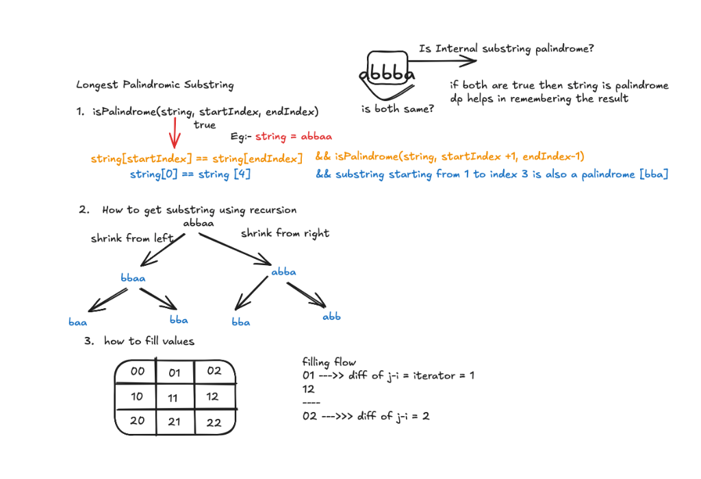

# Longest Palindromic Substring - Explanation

This document explains common approaches to solve the "Longest Palindromic Substring" problem: **Brute Force Recursion** and **Dynamic Programming (Tabulation)**.

---

## 1. Brute Force Recursion

### The Core Idea
To check if a string $s[i \dots j]$ is a palindrome:
1. **Base Case:** If the `start` index meets or exceeds the `end` index, we have successfully validated the substring.
2. **Recursive Step:** Compare $s[start]$ and $s[end]$. If they match, recursively check the inner substring $s[start+1 \dots end-1]$.

The function `longestPalindromeSubStr` explores all possible substrings by branches:
- Shifting the start index forward: `(start + 1, end)`
- Shifting the end index backward: `(start, end - 1)`

### Complexity
- **Time Complexity:** $O(2^N)$ - Without memoization, this implementation explores many overlapping subproblems repeatedly, leading to exponential time.
- **Space Complexity:** $O(N)$ - Due to the maximum depth of the recursion stack.

### Logic Diagram

---

## 2. Dynamic Programming (Tabulation)

### The Core Idea
Instead of breaking down the large string (top-down), we build up from the smallest possible palindromes (bottom-up).

### DP Table Definition
Let `dp[i][j]` be `true` if the substring $s[i \dots j]$ is a palindrome.

1. **Length 1:** Every single character is a palindrome: `dp[i][i] = true`.
2. **Length 2:** Two adjacent characters are a palindrome if they are identical: `dp[i][i+1] = (s[i] == s[i+1])`.
3. **Length 3 to N:** For a substring of length $k$, $s[i \dots j]$ is a palindrome if $s[i] == s[j]$ **AND** the inner part `dp[i+1][j-1]` is already `true`.

### Algorithm Logic
- We maintain `maxLength` and `startIndex` to track the best solution found so far.
- We iterate through all possible lengths $k$ from 3 up to $N$.

### Complexity
- **Time Complexity:** $O(N^2)$ - Two nested loops to fill the $N \times N$ DP table.
- **Space Complexity:** $O(N^2)$ - For the 2D DP table.

---

## 3. Logical Breakdown
The following diagram illustrates the recursive branching and the DP table filling logic for finding the longest palindromic substring.

---

## 4. Learn More (External Resources)
- [NeetCode's Video Explanation](https://neetcode.io/problems/longest-palindromic-substring)
- [LeetCode Editorial](https://leetcode.com/problems/longest-palindromic-substring/editorial/)
- [GeeksforGeeks Article](https://www.geeksforgeeks.org/longest-palindromic-substring/)

