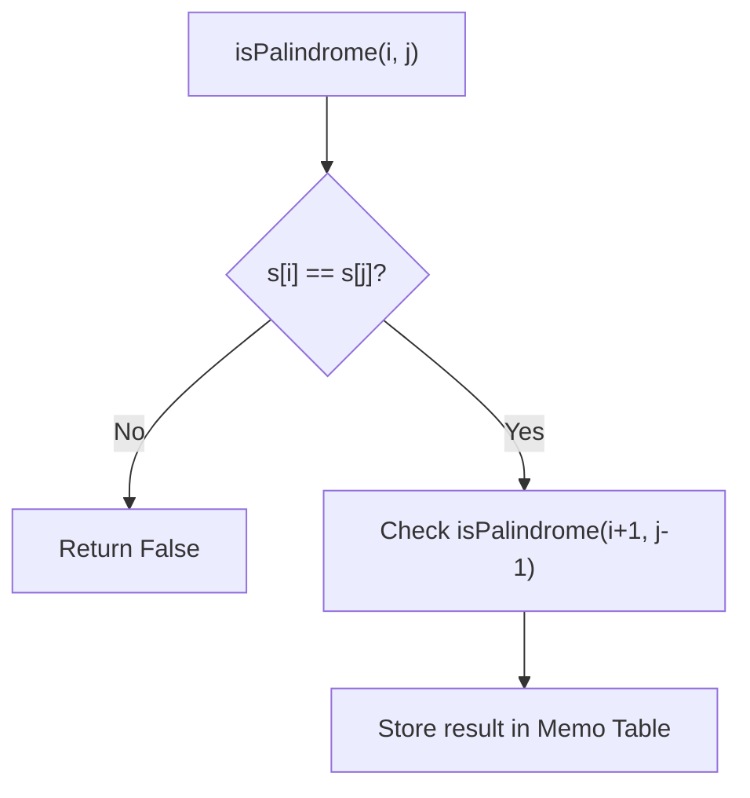

# Longest Palindromic Substring - Explanation

This document explains two common approaches to solve the "Longest Palindromic Substring" problem: **Recursion with Memoization** and **Dynamic Programming (Tabulation)**.

## What is a Palindrome?
A palindrome is a string that reads the same forward and backward. For example: `"aba"`, `"racecar"`, `"aa"`.

---

## 1. Recursion with Memoization

### The Core Idea
To check if a string $s[i \dots j]$ is a palindrome:
1. Check if the ends are the same: $s[i] == s[j]$.
2. If yes, check if the middle part $s[i+1 \dots j-1]$ is also a palindrome.

### Why Memoization?
Without memoization, we would solve the same subproblems many times. Memoization stores the result of `isPalindrome(i, j)` in a table so we only calculate it once for each $(i, j)$ pair.

### Logic Diagram


### Complexity
- **Time Complexity:** $O(N^2)$ - We check each substring once due to memoization.
- **Space Complexity:** $O(N^2)$ - For the memoization table.

---

## 2. Dynamic Programming (Tabulation)

### The Core Idea
Instead of starting from the large string and breaking it down (top-down), we start from the smallest possible palindromes (length 1 and 2) and build up to larger ones (bottom-up).

### DP Table Definition
Let `dp[i][j]` be a boolean value that is `true` if $s[i \dots j]$ is a palindrome.

1. **Base Case 1:** Every single character is a palindrome: `dp[i][i] = true`.
2. **Base Case 2:** Two adjacent characters are a palindrome if they are identical: `dp[i][i+1] = (s[i] == s[i+1])`.
3. **General Case:** For length $> 2$, $s[i \dots j]$ is a palindrome if $s[i] == s[j]$ **AND** the inner part `dp[i+1][j-1]` is true.

### Building the Table Diagram
```mermaid
grid-layout
    | s[i] == s[j] | dp[i+1][j-1] | Result dp[i][j] |
    |--------------|--------------|-----------------|
    | Same         | True         | True            |
    | Different    | Any          | False           |
    | Same         | False        | False           |
```

### Complexity
- **Time Complexity:** $O(N^2)$ - Two nested loops to fill the table.
- **Space Complexity:** $O(N^2)$ - For the 2D DP table.

## 3. Visual Concept


---

## 4. Learn More (External Resources)
For a deeper analysis and video explanations, check out these excellent resources:
- [NeetCode's Video Explanation](https://neetcode.io/problems/longest-palindromic-substring)
- [LeetCode Editorial (Official)](https://leetcode.com/problems/longest-palindromic-substring/editorial/)
- [GeeksforGeeks Article](https://www.geeksforgeeks.org/longest-palindromic-substring/)
