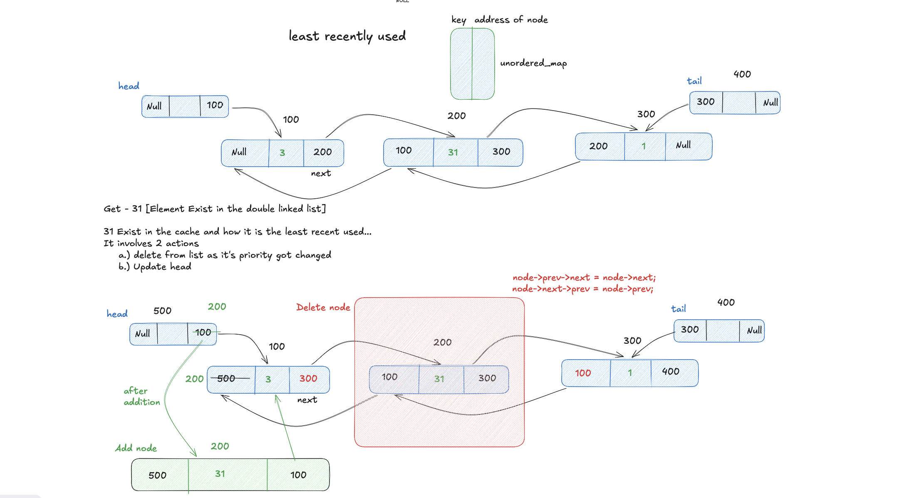
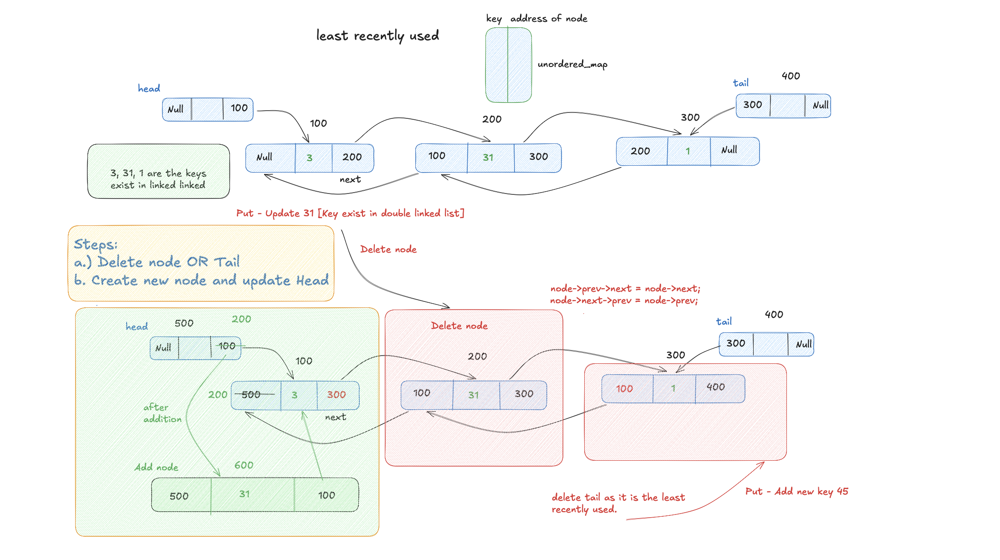

# LRU Cache

Design a data structure that follows the constraints of a Least Recently Used (LRU) cache.

## Approach
Use a combination of a **hash map** and a **doubly linked list**:
- The hash map provides O(1) access to nodes by key.
- The doubly linked list maintains the order of usage — most recently used at the front, least recently used at the back.
Don’t use map → use unordered_map (O(1))
mp.erase(key) - deleting key from map
## Operations

### `get(key)`
Return the value of the key if it exists, otherwise return `-1`. On a cache hit, move the node to the front (most recently used).

### `put(key, value)`
Insert or update the value. Move the node to the front. If the cache exceeds capacity, evict the node at the back (least recently used).

## Complexity
- **Time Complexity**: O(1) for both `get` and `put`
- **Space Complexity**: O(capacity)
