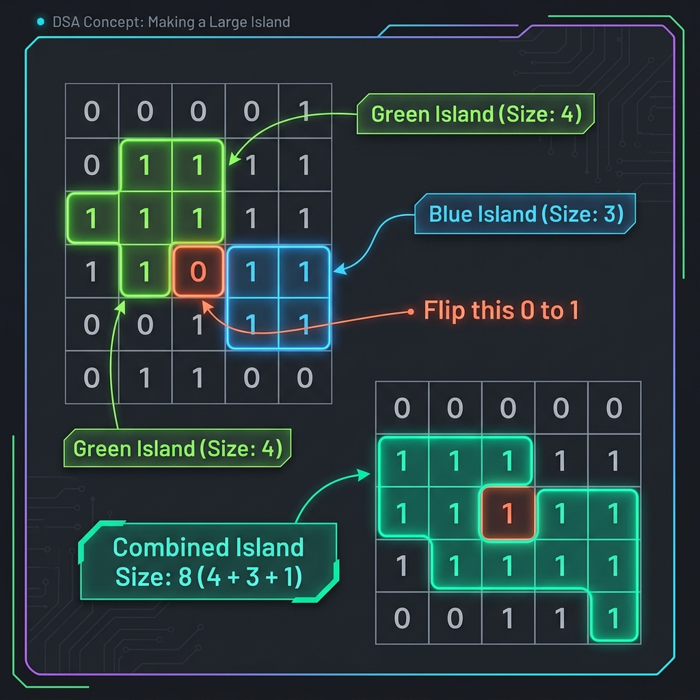

# Making a Large Island

- **Difficulty:** Hard
- **Categories:** Array, Depth-First Search, Breadth-First Search, Matrix, Hash Table
- **LeetCode:** [827. Making A Large Island](https://leetcode.com/problems/making-a-large-island/)

---

## Problem Description

You are given an `n x n` binary matrix `grid`. You can change at most one `0` to be `1`.

Return the size of the largest island in `grid` after applying this operation.

An **island** is a 4-directionally connected group of `1`s.

---

---

## Complexity Analysis

| Approach | Time Complexity | Space Complexity |
| :--- | :--- | :--- |
| **Brute Force** | $O(N^4)$ | $O(N^2)$ |
| **Optimized (Labeling)** | $O(N^2)$ | $O(N^2)$ |

---

## Optimized Approach: Island Labeling

To solve this efficiently, we avoid re-calculating island sizes for every single `0` flip.

### Phase 1: Label Islands
1.  Traverse the grid and find all connected components of `1`s.
2.  For each island, assign a **unique ID** (label) to all its cells.
3.  Store the size of each labeled island in a hash map: `Map<IslandID, Size>`.

### Phase 2: Evaluate Flips
1.  Iterate through each `0` cell in the grid.
2.  Check its 4 adjacent neighbors (Up, Down, Left, Right).
3.  Collect the unique `IslandIDs` from these neighbors using a set.
4.  The potential size if we flip this `0` is: $1 + \sum \text{sizes of unique neighbor islands}$.
5.  Keep track of the maximum size found.

### Edge Case
If the grid contains no `0`s, the answer is simply the total number of cells ($N \times N$).

---

## Implementations

- [Optimized BFS with Labeling (O(N²))](bfs-set.cpp)
- [Brute Force BFS (O(N⁴))](bfs.cpp)

---

## Related Questions

- [Number of Islands](../number-of-islands/README.md)
- [Max Area of Island](../max-area-of-island/README.md)
- [Count Sub Islands](../count-sub-islands/README.md)
