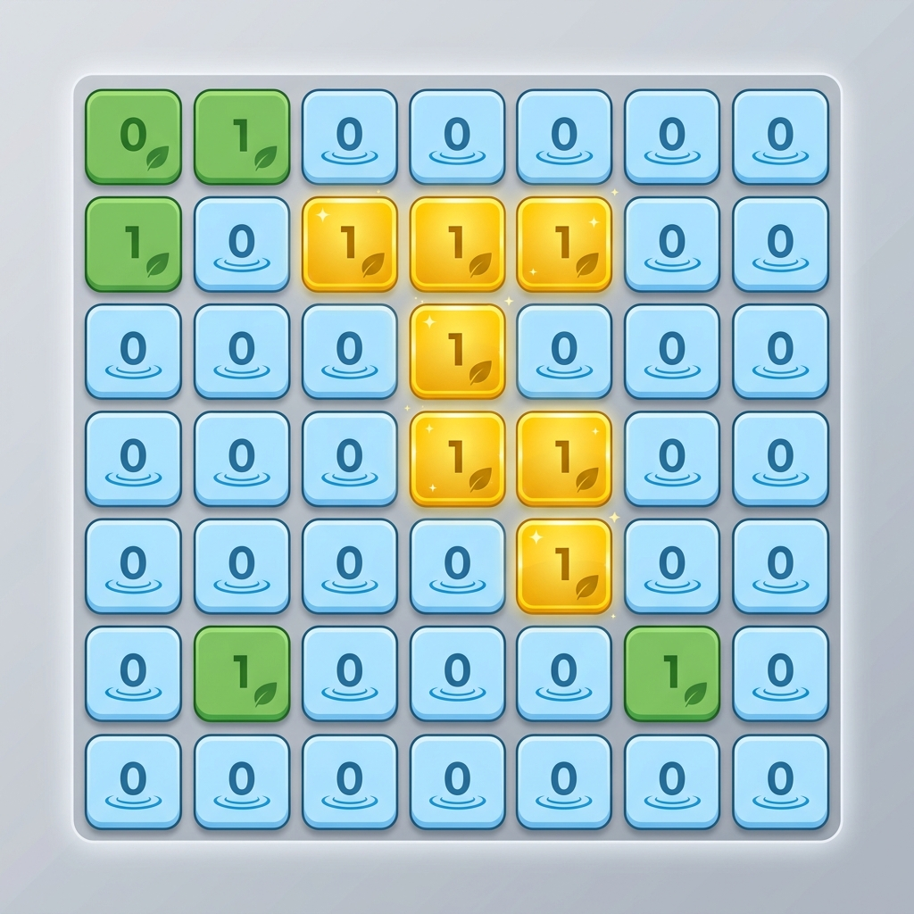

# Max Area of Island

## Problem Description
You are given an `m x n` binary matrix `grid`. An island is a group of `1`'s (representing land) connected **4-directionally** (horizontal or vertical.) You may assume all four edges of the grid are surrounded by water.

The **area** of an island is the number of cells with a value `1` in the island.

Return the *maximum area* of an island in `grid`. If there is no island, return `0`.

---

- **Difficulty:** Medium
- **Categories:** Array, Depth-First Search, Breadth-First Search, Union Find, Matrix
- **Time Complexity:** $O(M \times N)$ where $M$ is the number of rows and $N$ is the number of columns.
- **Space Complexity:** $O(M \times N)$ to store the visited matrix and the BFS queue/DFS recursion stack.

---

## Approaches

### 1. Breadth-First Search (BFS)
Iterate through each cell of the grid. If a cell contains `1` and has not been visited:
1. Start a BFS from that cell.
2. Use a queue to explore all connected land cells.
3. Keep track of the number of cells visited in this BFS instance.
4. Update the global maximum area.
5. Mark cells as visited to avoid redundant work.

### 2. Depth-First Search (DFS)
Similar to BFS, but use recursion or a stack to explore connected components. This is often more concise to implement in C++.

---

## Complexity Analysis
- **Time Complexity:** $O(M \times N)$
  - Each cell in the grid is visited at most once.
- **Space Complexity:** $O(M \times N)$
  - In the worst case (all land), the visited matrix takes $O(M \times N)$ space.
  - The BFS queue can also grow to $O(\min(M, N))$ in some cases, but the total visited nodes across all BFS calls is $O(M \times N)$.

---

## Learn More
- [NeetCode](https://neetcode.io/problems/max-area-of-island)
- [LeetCode](https://leetcode.com/problems/max-area-of-island/)
