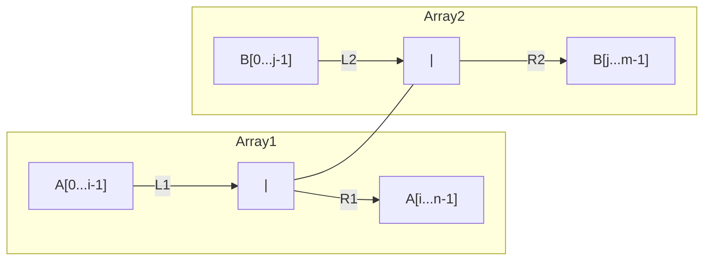
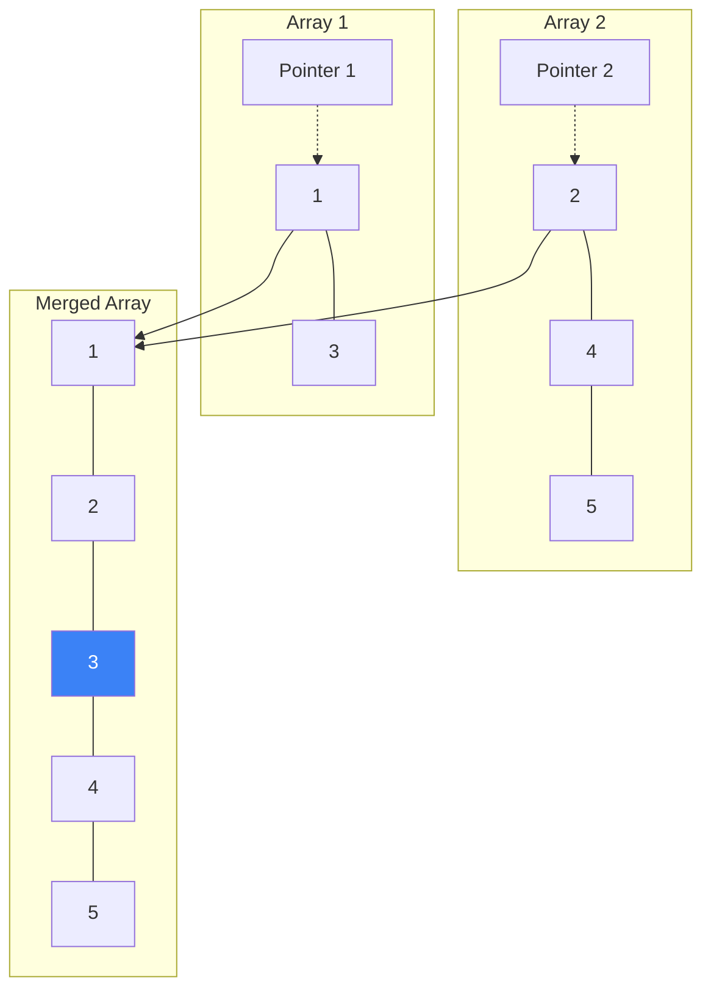

# Median of Two Sorted Arrays - Explanation

The goal is to find the median of two sorted arrays $A$ and $B$ of size $n$ and $m$ respectively.

## Approach: Binary Search on Partition

### The Core Idea
We want to partition both arrays into two halves (Left and Right) such that:
1. The total number of elements in the combined Left half is equal to (or one more than) the total number of elements in the combined Right half.
2. Every element in the Left half is less than or equal to every element in the Right half.

### Partitioning Diagram

We need to find $i$ such that:
- $max(A[i-1], B[j-1]) \leq min(A[i], B[j])$

### Why Binary Search?
Since the arrays are sorted, we can binary search for the correct partition index $i$ in the smaller array. This gives us a very efficient logarithmic time complexity.

## 3. Visual Concept

## Approach 2: Two Pointers (Merge Step of Merge Sort)

### The Core Idea
Instead of binary search, we can use a simpler approach based on the merge step of the Merge Sort algorithm. Since both arrays are already sorted, we can use two pointers (one for each array) to traverse them and build a single merged sorted array.

### Visual Diagram (Two Pointers)

Once merged, if the total length is odd, the median is the middle element. If even, the median is the average of the two middle elements. 
**Time Complexity:** O(M + N) where M and N are the sizes of the two arrays.
**Space Complexity:** O(M + N) to store the merged array.

---

## Learn More (External Resources)
For a deeper analysis and video explanations, check out these excellent resources:
- [NeetCode's Video Explanation](https://neetcode.io/problems/median-of-two-sorted-arrays)
- [TakeUForward (Striver's) Article](https://takeuforward.org/data-structure/median-of-two-sorted-arrays-of-different-sizes/)
- [LeetCode Editorial (Official)](https://leetcode.com/problems/median-of-two-sorted-arrays/editorial/)

---

## Implementations
The code dependencies and full implementations for these approaches can be found here:
- **Binary Search (O(log(min(M, N))))**: [`binary_search_iterative.cpp`](./binary_search_iterative.cpp)
- **Two Pointers (O(M+N))**: [`two-pointer.cpp`](./two-pointer.cpp)
