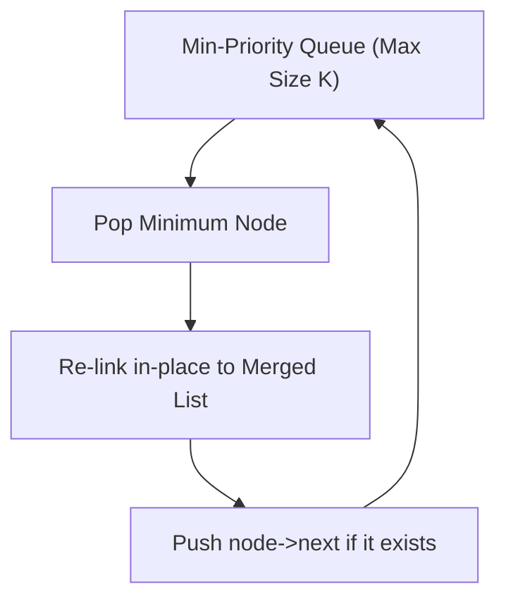
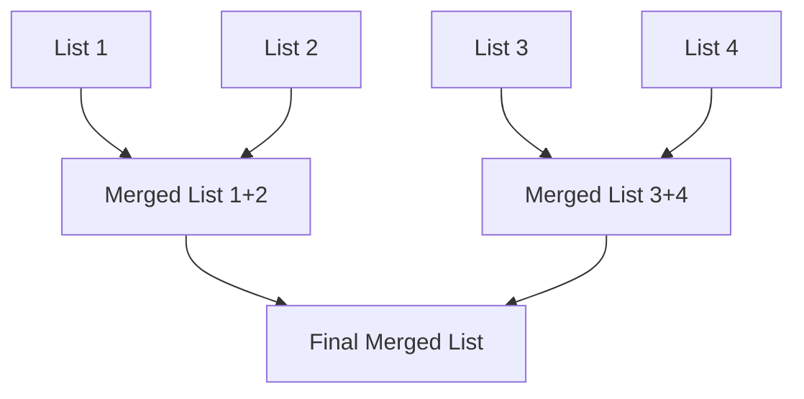

# Merge K Sorted Lists - Explanation

You are given an array of $k$ linked-lists `lists`, each linked-list is sorted in ascending order. Merge all the linked-lists into one sorted linked-list and return it.

---

## Approach 1: Min-Priority Queue (Optimal Heap)

### The Core Idea
We maintain a min-heap that stores at most $K$ elements at any given time (one element from each list). We extract the minimum element, append it to our merged list by re-pointing it in-place, and push the next element of that list back into the queue.

### Heap Visualization

### Complexity
- **Time Complexity:** $O(N \log K)$ where $N$ is the total number of nodes across all lists, and $K$ is the number of lists.
- **Space Complexity:** $O(K)$ to hold the priority queue.

---

## Approach 2: Divide and Conquer

### The Core Idea
Merge lists in pairs iteratively, similar to the merge step in Merge Sort.

### Merge Process Diagram

### Complexity
- **Time Complexity:** $O(N \log K)$ because we merge lists in $\log K$ levels, processing $N$ nodes at each level.
- **Space Complexity:** $O(1)$ if done iteratively.

---

## Approach 3: Naive Priority Queue (Unoptimized)

### The Core Idea
Collect all values from all $N$ nodes of all lists, push them all into a priority queue, and construct a brand-new linked list by popping elements and allocating new nodes.

### Inefficiencies (Why it is not optimized)
1. **Time Complexity is $O(N \log N)$**: Since the queue stores all $N$ elements at once, pushes and pops scale with $\log N$. In contrast, the optimal heap scales with $\log K$.
2. **Space Complexity is $O(N)$**:
   - The queue holds $N$ elements simultaneously, requiring $O(N)$ auxiliary space.
   - It performs $N$ dynamic memory allocations (`new ListNode(...)`) to duplicate the values into new nodes, wasting another $O(N)$ memory. The optimal heap re-uses existing node pointers in-place, requiring $O(1)$ additional space.
3. **Memory Overhead**: Frequent dynamic heap allocation is slower and leads to fragmentations compared to re-linking nodes in-place.

---

## Visual Concept

---

## Files

| File | Description |
| :--- | :--- |
| [`heap.cpp`](./heap.cpp) | Optimal $O(N \log K)$ time and $O(K)$ space heap solution with in-place pointer re-linking |
| [`divide_and_conquer.cpp`](./divide_and_conquer.cpp) | Iterative divide-and-conquer solution with $O(1)$ auxiliary space |
| [`naive_heap.cpp`](./naive_heap.cpp) | Naive, unoptimized priority queue solution storing $N$ elements and allocating new nodes |

---

## Learn More (External Resources)
- [NeetCode's Video Explanation](https://neetcode.io/problems/merge-k-sorted-lists)
- [AlgoMonster Explanation](https://algo.monster/problems/merge_k_sorted_lists)
- [GeeksforGeeks Article](https://www.geeksforgeeks.org/merge-k-sorted-linked-lists/)
