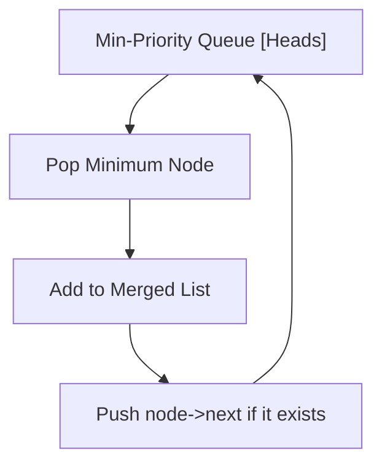
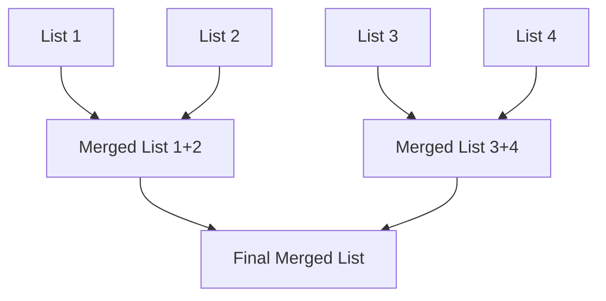
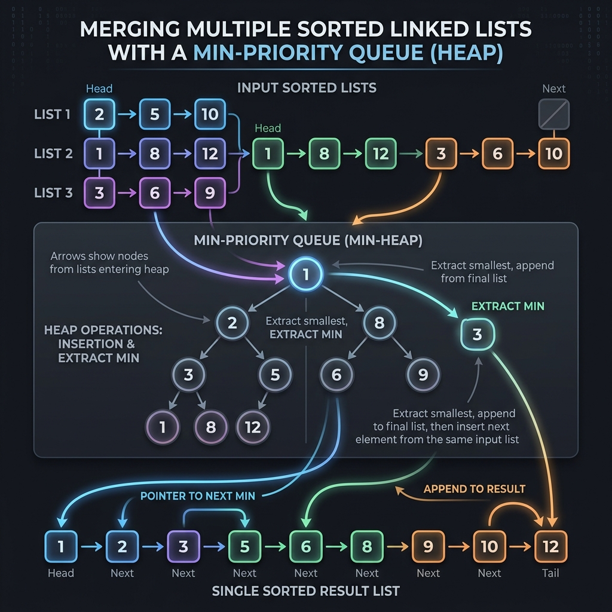

# Merge K Sorted Lists - Explanation

You are given an array of $k$ linked-lists `lists`, each linked-list is sorted in ascending order. Merge all the linked-lists into one sorted linked-list and return it.

## Approach 1: Min-Priority Queue (Heap)

### The Core Idea
We use a min-priority queue to keep track of the head of each list. We repeatedly extract the minimum element and add it to our merged list, then take the next element from the same list and put it back into the priority queue.

### Heap Visualization

### Complexity
- **Time Complexity:** $O(N \log K)$ where $N$ is total number of nodes and $K$ is number of lists.
- **Space Complexity:** $O(K)$ for the priority queue.

---

## Approach 2: Divide and Conquer

### The Core Idea
Merge lists in pairs using a merge strategy similar to Merge Sort.

### Merge Process Diagram

## 3. Visual Concept

---

## 4. Learn More (External Resources)
For a deeper analysis and video explanations, check out these excellent resources:
- [NeetCode's Video Explanation](https://neetcode.io/problems/merge-k-sorted-lists)
- [AlgoMonster Explanation](https://algo.monster/problems/merge_k_sorted_lists)
- [GeeksforGeeks Article](https://www.geeksforgeeks.org/merge-k-sorted-linked-lists/)
