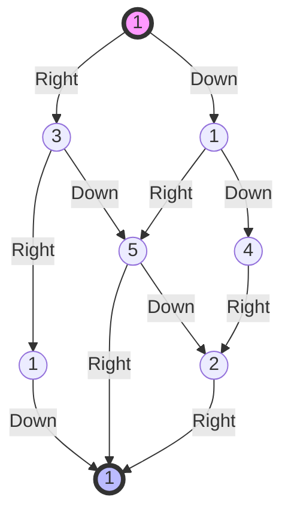

# Minimum Path Sum

## Problem Description
Given a `m x n` grid filled with non-negative numbers, find a path from top left to bottom right, which minimizes the sum of all numbers along its path.

**Note:** You can only move either down or right at any point in time.

### Visual Representation

---

- **Difficulty:** Medium
- **Categories:** Array, Dynamic Programming, Matrix
- **Time Complexity:** $O(M \times N)$
- **Space Complexity:** $O(M \times N)$ (can be optimized to $O(N)$)

---

## Approach: 2D Dynamic Programming (Bottom-Up)

The problem can be solved using Dynamic Programming because it has:
1. **Optimal Substructure:** The minimum path to $(i, j)$ depends on the minimum paths to its predecessors $(i-1, j)$ and $(i, j-1)$.
2. **Overlapping Subproblems:** Many paths share the same sub-paths.

### Recurrence Relation:
$dp[i][j] = grid[i][j] + \min(dp[i-1][j], dp[i][j-1])$

### Boundary Conditions:
- For the first row: $dp[0][j] = grid[0][j] + dp[0][j-1]$ (only move right)
- For the first column: $dp[i][0] = grid[i][0] + dp[i-1][0]$ (only move down)

---

## Complexity Analysis
- **Time Complexity:** $O(M \times N)$
  - We iterate through each cell of the grid exactly once.
- **Space Complexity:** $O(M \times N)$
  - We use a 2D array of size $M \times N$ to store the path sums.
  - *Optimization:* This can be reduced to $O(\min(M, N))$ by only keeping track of the previous row or column.

---

## Learn More
- [NeetCode](https://neetcode.io/problems/minimum-path-sum)
- [LeetCode](https://leetcode.com/problems/minimum-path-sum/)
