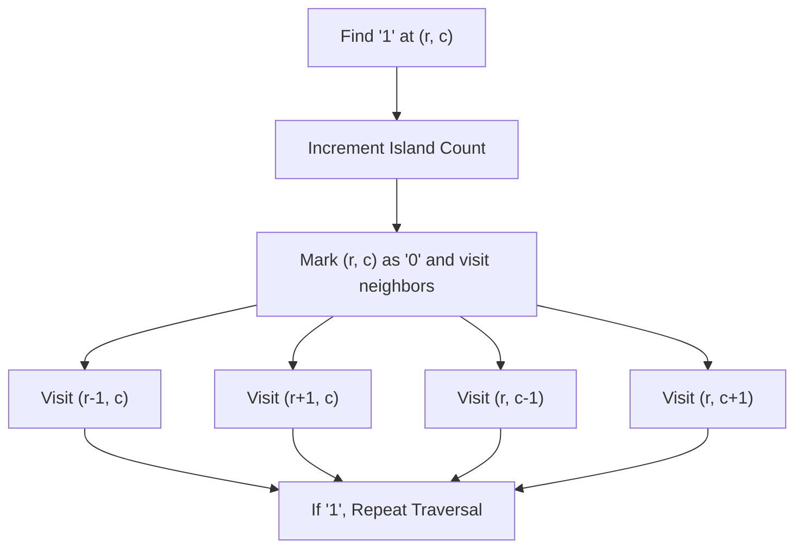

# Number of Islands - Explanation

Given an $m \times n$ 2D binary grid which represents a map of '1's (land) and '0's (water), return the number of islands.

An island is surrounded by water and is formed by connecting adjacent lands horizontally or vertically.

## Approach: Grid Traversal (DFS/BFS)

### The Core Idea
We iterate through every cell in the grid. If we find a '1' (land), it's the start of a new island. We then use a traversal algorithm (DFS or BFS) to visit all connected '1's and mark them as '0' (visited) so we don't count them again.

### Traversal Diagram

### Complexity
## 3. Visual Concept

---

## 4. Learn More (External Resources)
For a deeper analysis and video explanations, check out these excellent resources:
- [NeetCode's Video Explanation](https://neetcode.io/problems/number-of-islands)
- [AlgoMonster Explanation](https://algo.monster/problems/num_islands)
- [GeeksforGeeks Article](https://www.geeksforgeeks.org/find-number-of-islands/)
