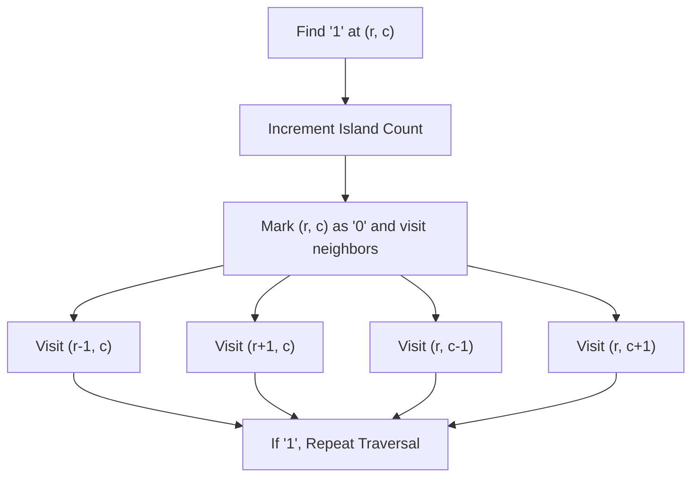
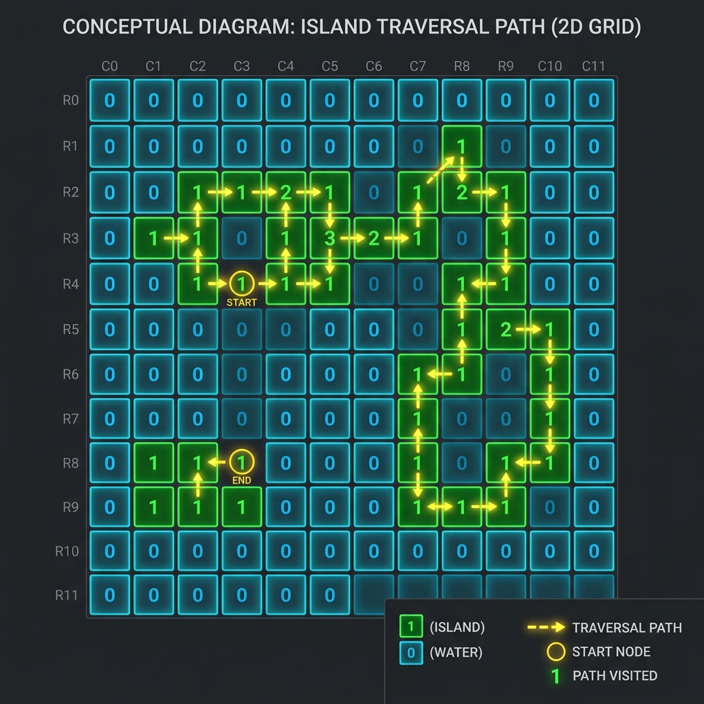

# Number of Islands

- **Difficulty:** Medium
- **Categories:** Array, Depth-First Search, Breadth-First Search, Union Find, Matrix

---

## Complexity Analysis

- **Time Complexity:** $O(M \times N)$
  - We iterate through every cell in the $M \times N$ grid exactly once.
  - Each cell containing '1' is visited during a DFS/BFS traversal and marked as '0', ensuring it's not processed again.
- **Space Complexity:** $O(M \times N)$
  - In the worst case (e.g., all '1's), the recursion stack for DFS or the queue for BFS can grow to $O(M \times N)$.

---

Given an $m \times n$ 2D binary grid which represents a map of '1's (land) and '0's (water), return the number of islands.

An island is surrounded by water and is formed by connecting adjacent lands horizontally or vertically.

---

## Approach: Grid Traversal (DFS/BFS)

### The Core Idea
We iterate through every cell in the grid. If we find a '1' (land), it's the start of a new island. We then use a traversal algorithm (DFS or BFS) to visit all connected '1's and mark them as '0' (visited) so we don't count them again.

### Traversal Diagram

### Visual Concept

---

## Related Interview Questions
- [Max Area of Island](../max-area-of-island/README.md)
- [Number of Closed Islands](../number-of-closed-islands/README.md)
- [Flood Fill](../flood-fill/README.md)
- [Count Sub Islands](../count-sub-islands/README.md)

---

## Learn More
- [NeetCode](https://neetcode.io/problems/number-of-islands)
- [LeetCode](https://leetcode.com/problems/number-of-islands/)
- [AlgoMonster](https://algo.monster/problems/num_islands)
