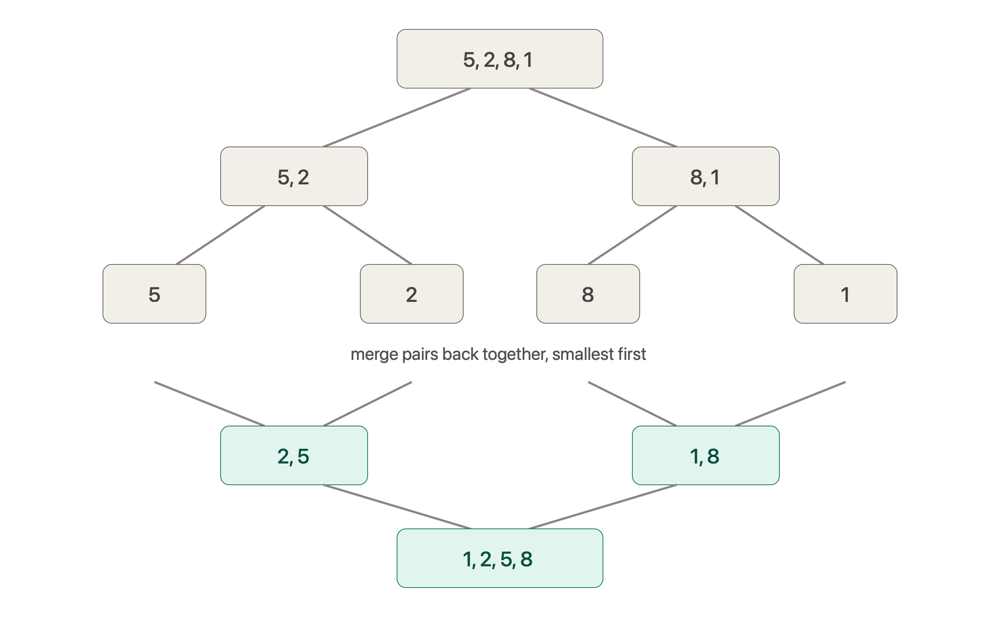

# Sort an Array

**LeetCode #912** · [LeetCode](https://leetcode.com/problems/sort-an-array/) · [NeetCode](https://neetcode.io/problems/sort-an-array)

- **Difficulty:** Medium
- **Categories:** Array, Divide and Conquer, Sorting, Heap, Merge Sort, Quick Sort

---

## Complexity Analysis

| Approach | Time Complexity | Space Complexity | Description |
| :--- | :--- | :--- | :--- |
| **Merge Sort (Single Scratch Buffer)** | $O(N \log N)$ | $O(N)$ | Divide-and-conquer using a single auxiliary scratch vector. Stable and guaranteed $O(N \log N)$ performance. |
| **Merge Sort (Sub-vectors)** | $O(N \log N)$ | $O(N \log N)$ | Recursive creation of left/right sub-vectors at each level. Simple & intuitive, but higher allocation overhead. |
| **QuickSort (Lomuto Partition)** | $O(N \log N)$ avg, $O(N^2)$ worst | $O(\log N)$ stack avg, $O(N)$ worst | In-place partition. Deterministic end pivot can hit $O(N^2)$ on sorted arrays. |

---

## Problem Statement

Given an array of integers `nums`, sort the array in ascending order and return it.

You must solve the problem without using any built-in functions in $O(N \log N)$ time complexity and with the smallest space complexity possible.

**Examples:**
```text
Input:  nums = [5, 2, 3, 1]
Output: [1, 2, 3, 5]

Input:  nums = [5, 1, 1, 2, 0, 0]
Output: [0, 0, 1, 1, 2, 5]
```

---

## Visual Overview

### Merge Sort Breakdown (Divide & Conquer)



---

## Approach 1: Merge Sort (Guaranteed $O(N \log N)$)

Merge Sort recursively splits the array into two equal halves, sorts each half, and merges the two sorted halves using two pointers and an auxiliary buffer array `temp`.

### Algorithm Steps:
1. **Divide**: Calculate `mid = start + (end - start) / 2`.
2. **Conquer**: Recursively call `mergeSort` on `[start, mid]` and `[mid + 1, end]`.
3. **Combine**: Merge the two sorted halves into `temp[start..end]`, then copy back to `nums[start..end]`.

---

## Approach 2: QuickSort (Lomuto Partitioning)

QuickSort selects a pivot element and partitions the array such that all elements smaller than the pivot are placed to its left, and all elements greater or equal are placed to its right.

### Algorithm Steps:
1. **Pivot Selection**: Choose `pivot = nums[end]`. Maintain boundary index `left = start`.
2. **Scan & Swap**: Iterate `i` from `start` to `end - 1`. If `nums[i] < pivot`, swap `nums[i]` with `nums[left]` and increment `left`.
3. **Place Pivot**: Swap `nums[left]` with `nums[end]` to lock the pivot into its correct final sorted index.
4. **Recursion**: Recursively partition `[start, left - 1]` and `[left + 1, end]`.

> **Worst-Case Warning**: Picking a fixed end pivot `nums[end]` leads to $O(N^2)$ worst-case time complexity when the input array is already sorted or contains many duplicates. In competitive programming / LeetCode, randomizing the pivot index (`rand()`) or using 3-way partitioning prevents TLE.

---

## Files

| File | Description |
| :--- | :--- |
| [`merge_sort.cpp`](./merge_sort.cpp) | Guaranteed $O(N \log N)$ Merge Sort implementation with a single auxiliary buffer |
| [`merge_sort_out_of_place.cpp`](./merge_sort_out_of_place.cpp) | Functional Merge Sort implementation creating left/right sub-vectors |
| [`quick_sort.cpp`](./quick_sort.cpp) | QuickSort implementation using Lomuto partition |
| [`merge_sort_divide_conquer.png`](./merge_sort_divide_conquer.png) | Visual diagram showing the divide-and-conquer execution tree |
| [`lomuto_partition_swap_steps.html`](./lomuto_partition_swap_steps.html) | Interactive step-by-step visualizer for Lomuto partition swaps |
| [`lomuto_partition_1_2_5_9_3.html`](./lomuto_partition_1_2_5_9_3.html) | Interactive step-by-step visualizer for partition example `[1, 2, 5, 9, 3]` |

---

## Edge Cases

| Scenario | Behavior |
| :--- | :--- |
| `nums` has 1 element | Base case `start >= end` returns immediately |
| Array is already sorted | Merge Sort operates in $O(N \log N)$; QuickSort requires randomized pivot to avoid $O(N^2)$ |
| All elements identical (e.g., `[5,5,5,5]`) | Merge Sort handles in $O(N \log N)$; 3-way partition QuickSort handles in $O(N)$ |
| Array contains negative numbers | Handled natively by integer comparison |

---

## Related Problems

- [Kth Largest Element in an Array (LC #215)](https://leetcode.com/problems/kth-largest-element-in-an-array/) — QuickSelect algorithm
- [Sort Colors (LC #75)](https://leetcode.com/problems/sort-colors/) — 3-way Dutch National Flag partitioning
- [Merge Sorted Array (LC #88)](https://leetcode.com/problems/merge-sorted-array/) — Two-pointer in-place merge
