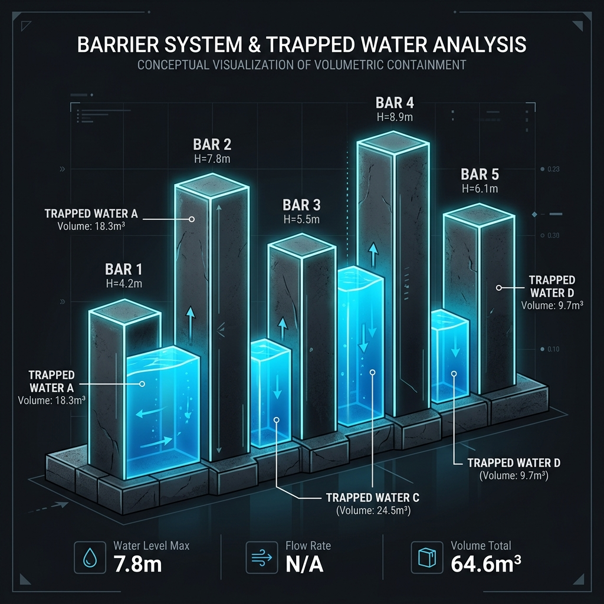

# Trapping Rain Water

- **Difficulty:** Hard
- **Categories:** Array, DP, Two Pointers
- **Time Complexity:** O(N)
- **Space Complexity:** O(N)

---

Given $n$ non-negative integers representing an elevation map where the width of each bar is 1, compute how much water it can trap after raining.

## Approach 1: Dynamic Programming

### The Core Idea
For each bar at index $i$, the amount of water it can trap is determined by the minimum of the highest bars to its left and right, minus its own height.
$Water[i] = \min(\text{left\_max}[i], \text{right\_max}[i]) - height[i]$

### Complexity
- **Time Complexity:** $O(N)$ - Three passes across the array.
- **Space Complexity:** $O(N)$ - To store left\_max and right\_max arrays.

---

## Approach 2: Two Pointers (Optimized)

### The Core Idea
Instead of pre-calculating the left and right maximums, we can use two pointers starting from ends and move towards the center. We maintain `leftMax` and `rightMax` on the fly.

### Complexity
- **Time Complexity:** $O(N)$ - Single pass.
- **Space Complexity:** $O(1)$ - No extra space used.

---

## 3. Visual Concept

---

## 4. Learn More (External Resources)
For a deeper analysis and video explanations, check out these excellent resources:
- [NeetCode's Video Explanation](https://neetcode.io/problems/trapping-rain-water)
- [LeetCode Editorial (Official)](https://leetcode.com/problems/trapping-rain-water/editorial/)
- [GeeksforGeeks Article](https://www.geeksforgeeks.org/trapping-rain-water/)
