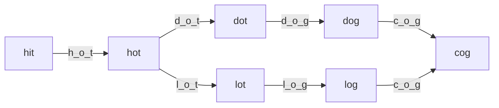
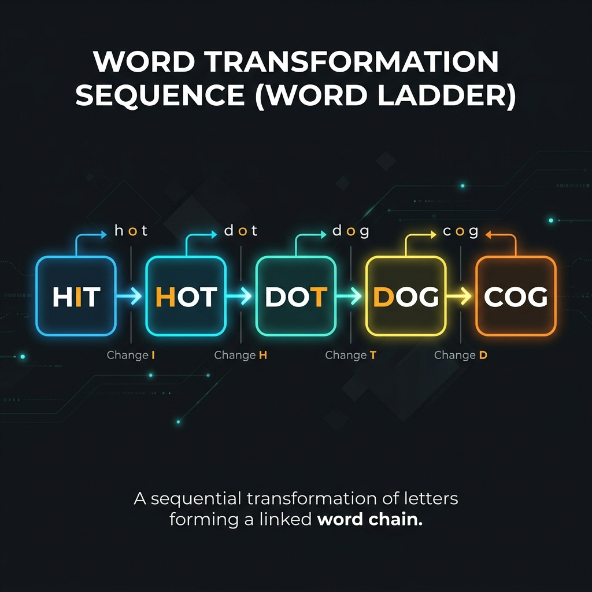

# Word Ladder - Explanation

A transformation sequence from word `beginWord` to word `endWord` using a dictionary `wordList` is a sequence of words `beginWord -> s1 -> s2 -> ... -> sk` such that:
1. Every adjacent pair of words differs by a single letter.
2. Every `si` for $1 \leq i \leq k$ is in `wordList`.
3. `sk == endWord`.

## Approach: Breadth-First Search (BFS)

### The Core Idea
This problem can be modeled as finding the shortest path in an unweighted graph where:
- Each word is a node.
- An edge exists between two nodes if they differ by exactly one letter.

Since we need the **shortest path**, BFS is the optimal choice.

### Traversal Diagram

### Complexity
- **Time Complexity:** $O(M^2 \times N)$, where $M$ is the length of each word and $N$ is total number of words in the list.
- **Space Complexity:** $O(M^2 \times N)$.

---

## 3. Visual Concept

---

## 4. Learn More (External Resources)
For a deeper analysis and video explanations, check out these excellent resources:
- [NeetCode's Video Explanation](https://neetcode.io/problems/word-ladder)
- [AlgoMonster Explanation](https://algo.monster/problems/word_ladder)
- [GeeksforGeeks Article](https://www.geeksforgeeks.org/word-ladder-length-of-shortest-chain-to-reach-a-target-word/)
