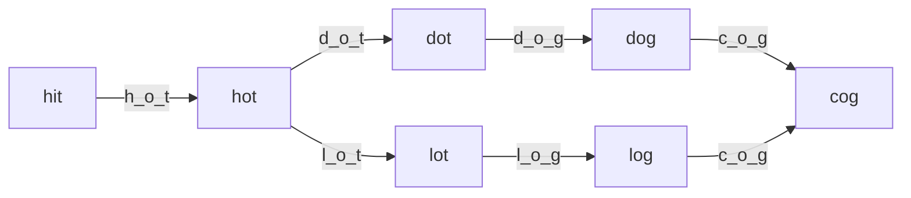

# Word Ladder - Explanation

A transformation sequence from word `beginWord` to word `endWord` using a dictionary `wordList` is a sequence of words `beginWord -> s1 -> s2 -> ... -> sk` such that:
1. Every adjacent pair of words differs by a single letter.
2. Every `si` for $1 \leq i \leq k$ is in `wordList`.
3. `sk == endWord`.

## Approach: Breadth-First Search (BFS)

### The Core Idea
This problem can be modeled as finding the shortest path in an unweighted graph where:
- Each word is a node.
- An edge exists between two nodes if they differ by exactly one letter.

Since we need the **shortest path**, BFS is the optimal choice.

### Traversal Diagram


### Complexity
- **Time Complexity:** $O(M^2 \times N)$, where $M$ is the length of each word and $N$ is total number of words in the list.
- **Space Complexity:** $O(M^2 \times N)$.

---

## Common Pitfalls and Optimizations

When implementing BFS for the Word Ladder problem, several subtle issues can impact performance and correctness:

### 1. Missing `beginWord` in Visited Set
**Problem:** Not marking `beginWord` as visited initially can cause issues if it appears in `wordList` or if there's a cycle back to it.
**Fix:** Explicitly mark it before starting the BFS loop.
```cpp
q.push({beginWord, 1});
visited[beginWord] = true;  // Mark it as visited
```

### 2. Inefficient Access with `std::map::operator[]`
**Problem:** Using `wordDist[tmpStr]` evaluates to `false` if `tmpStr` doesn't exist, but it *also* creates a new entry in the map. During string permutation, this can insert thousands of invalid strings, causing Memory Limit Exceeded (MLE) or Time Limit Exceeded (TLE).
**Fix:** Use `.count()` or `.find()` to check existence without modifying the map.
```cpp
if(wordDist.count(tmpStr) && !visited[tmpStr]) {
    // count() doesn't create entries
}
```

### 3. Unnecessary Iterator Loops
**Problem:** Using verbose, old-style iterator loops to populate a set or map makes code harder to read.
**Fix:** Use range-based for loops, or even better, initialize an `unordered_set` directly from the vector's iterators.
```cpp
// Instead of verbose iterators:
unordered_set<string> wordSet(wordList.begin(), wordList.end());
```

### 4. Using `unordered_map<string, bool>` for Visited Elements
**Problem:** Maps with boolean values are wasteful (8 bytes per entry overhead). 
**Fix:** Use `unordered_set<string>` instead for $O(1)$ lookup and $0$ value overhead.
```cpp
unordered_set<string> visited;  // More efficient than map<string, bool>
```

---

## 3. Visual Concept


---

## 4. Learn More (External Resources)
For a deeper analysis and video explanations, check out these excellent resources:
- [NeetCode's Video Explanation](https://neetcode.io/problems/word-ladder)
- [AlgoMonster Explanation](https://algo.monster/problems/word_ladder)
- [GeeksforGeeks Article](https://www.geeksforgeeks.org/word-ladder-length-of-shortest-chain-to-reach-a-target-word/)
